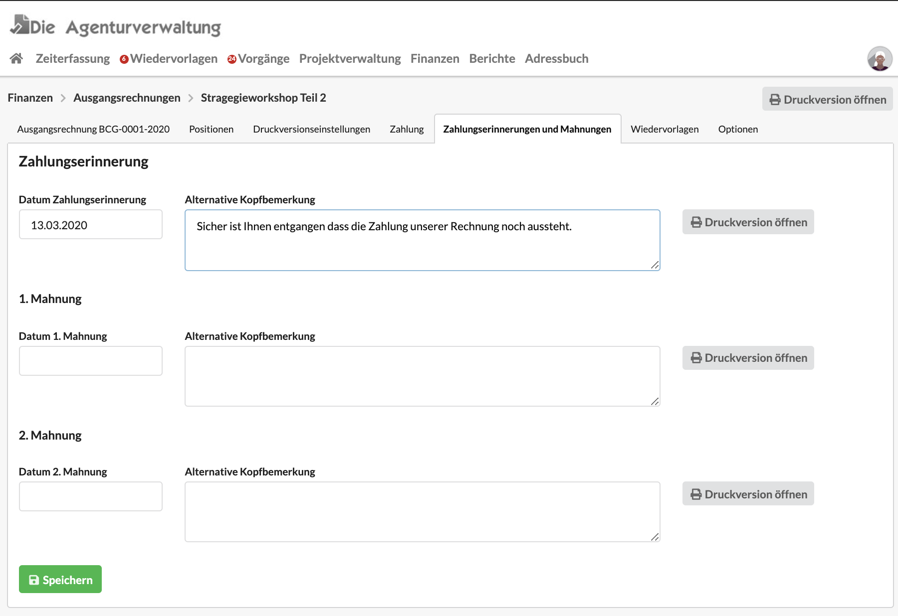

# Zahlungserinnerungen und Mahnungen

Im Reiter "Zahlungserinnerungen und Mahnungen" kann eine Druckversion einer Zahlungserinnerung, ersten oder zweiten Mahnung erstellt werden.

Dabei kann die in der Rechnung gegebene Kopfbemerkung durch einen alternativen Text ersetzt werden, sowie ein Mahnungsdatum angegeben werden.

Die resultierende Druckversion führt als Überschrift z.B. "Zahlungserinnerung", bezieht sich auf das Datum der Originalrechnung und ersetzt unsere Kopfbemerkung mit dem hier eingegebenen \(optionalen\) Text.

## Mahngebühren

Die Agenturverwaltung unterstützt an dieser Stelle keine Mahngebühren. Wer dennoch eine Mahngebühr anwenden möchte, kann das Dokument um einen negativen \(!\) Brutto-Abzug  von z.B. -5,- EUR mit der Bezeichnung "Mahngebühr" ergänzen.

Dieser Wert wird dann unterhalb der Brutto-Summe zur Rechnung aufaddiert.

