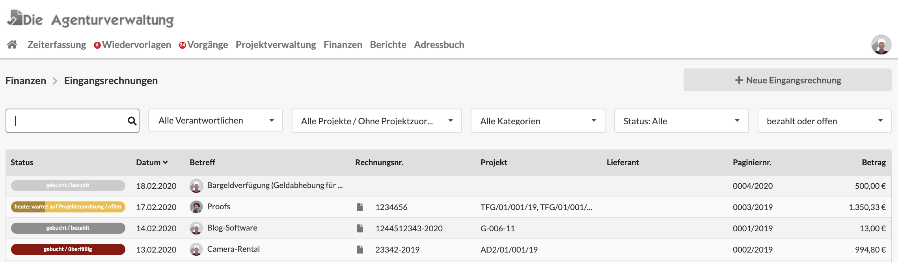
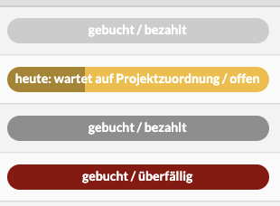

# Eingangsrechnungen

## Filter in der Eingangsrechnungsliste

Die Liste der Eingangrechnungen lässt sich über Filter oberhalb der Liste einschränken.

### Suche mit Wildcards \*

Die Suche erlaubt das Suchen nach Dokumentennummer, Projektnummer,Lieferant oder Betreff des Dokuments.  
Mit dem Asterisk \(\*\) können auch Wildcard-Suchen durchgeführt werden im abgebildeten Beispiel kann ich z.B. durch die Eingab des Suchbegriffs `12*2020`  Alle Dokumente finden in denen "12" gefolgt von "2020" vorkommt. Wir hätten hier z.B. einen Suchtreffer beim zweiten Dokument der Liste.

### Suche nach Verantwortlichem

Über diesen Filter kann ein Nutzer ausgewählt werden und die Liste zeigt dann nur die Dokumente dieses Nutzers. Der Filter beinhaltet auch den Eintrag "Meine Eingangsrechnungen".

### **Suche nach Status**

Dieser Filter schränkt die Liste nach Dokumenten ein, die sich in einen bestimmten Status befinden.


FIltereinstellungen werden bis zur nächsten Anmeldung am System gespeichert.


## Status von Eingangsrechnungen

Eingangsrechnungen laufen von der Erfassung des Belegs bis zur Übergabe in die Buchhaltung durch folgende Prozessschritte:

#### wartet auf Erfassung

Ein Beleg wurde z.B. bereits als Anhang hochgeladen, jedoch noch nicht weiter erfasst.

#### wartet auf Projektzuordnung

Dieser Beleg wurde erfasst und wartet darauf dass ein Projektmanager ihn als Fremdleistung auf ein oder mehrere Projekte bucht.  
Unter Umständen wurde der Projektmanager bereits per Wiedervorlage benachrichtigt.

#### wartet auf Buchung

Die Zuordnung des Belegs zu einem oder mehreren Projekten ist erfolgt. Er wartet ggf. noch auf Bezahlung und Übergabe in die Buchhaltung.

#### gebucht

Dieser Beleg wurde an die Buchhaltung übergeben.


**Hinweis:** In deinem Unternehmen sind eventuell nicht alle Prozessschritte aktiviert. Sprich den Kundenservice an, wenn du daran etwas ändern möchtest: info@dieagenturverwaltung.de


In der Liste der Eingangsrechnungen kann auf einen Blick erkannt werden, in welchem Status sich ein Dokument befindet:

