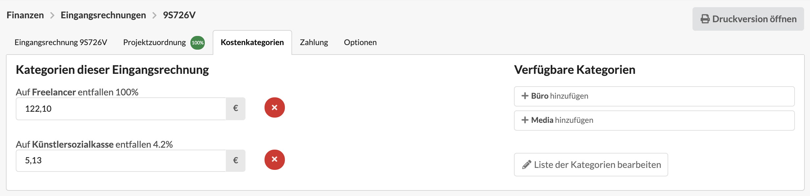

# Kostenkategorien & KSK

## Was sind Kostenkategorien?

Kostenkategorien sind nicht Projektgebunden und können in Eingangsrechnungen verwendet werden. Eine Eingangsrechnung kann einer oder mehreren Kostenkategorien angehören.

Beispiele für Kostenkategorien sind z.B. Personal, Gehälter, Büro, Reise, Akquise.

Werden Kategorien umbenannt, gilt dies auch rückwirkend für alle dieser Kategorie angehörenden Eingangsrechnungen.

Die Kategorie **Künstlersozialkasse** ist fest definiert und kann nicht geändert oder gelöscht werden.

## Warum Kostenkategorien?

Kategorisierte Eingangsrechnungen können statistisch unter "Berichte &gt; Auswertung Kostenkategorien"  ausgewertet werden. So lässt sich z.B. ermitteln welches Budget in einem Zeitraum z.B. für Reisen, Akquise oder Freelancer zur Verfügung gestellt wurde. Evtl. lassen sich dann neue Verträge mit den Lieferanten verhandeln.

