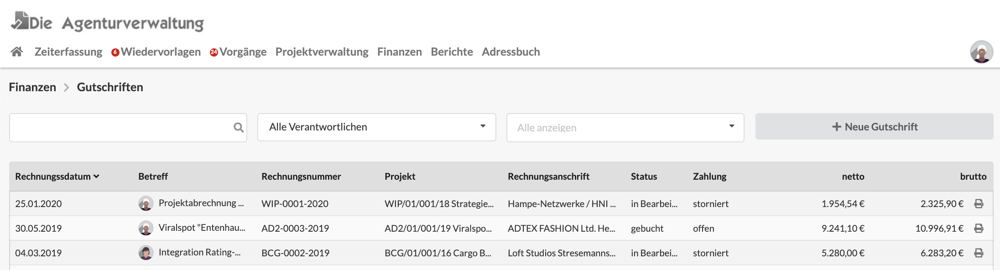

# Gutschriften

## Filter in der Liste der Gutschriften

Die Liste der Gitschriften lässt sich über Filter oberhalb der Liste einschränken.

### Suche mit Wildcards \*

Die Suche erlaubt das Suchen nach Dokumentennummer, Projektnummer, Kunde/Lieferant oder Betreff des Dokuments.\
Mit dem Asterisk (\*) können auch Wildcard-Suchen durchgeführt werden im abgebildeten Beispiel kann ich z.B. durch die Eingab des Suchbegriffs `AD*19`  Alle Dokumente finden in denen "AD" gefolgt von "19" vorkommt. Wir hätten hier z.B. einen Suchtreffer beim zweiten Dokument der Liste.

### Suche nach Verantwortlichem

Über diesen Filter kann ein Nutzer ausgewählt werden und die Liste zeigt dann nur die Dokumente dieses Nutzers. Der Filter beinhaltet auch den Eintrag "Meine Ausgangsrechnungen".

### **Suche nach Status**

Dieser Filter schränkt die Liste nach Dokumenten ein, die sich in einen bestimmten Status befinden.


FIltereinstellungen werden bis zur nächsten Anmeldung am System gespeichert.


## Status von Gutschriften

Gutschriften laufen durch folgende Prozessschritte:

#### in Bearbeitung

Dieses Dokument wird zur Zeit erstellt oder gerade geändert, es wird in keiner Auswertung mitberücksichtigt. Dokumente in diesem Status tauchen in keiner Statistik auf.

#### wartet auf Versand

Dieses Dokument ist fertiggestellt, wartet jedoch noch auf Prüfung durch einen anderen Nutzer bevor es versendet werden kann. Dokumente in diesem Status tauchen in keiner Statistik auf.

#### versandt

Dieses Dokument wurde bereits an den Kunden gsendet. In Statistiken wird der _negative_ Umsatz des Dokuments nun mitberücksichtigt.

#### reklamiert

Der Kunde hat dieses Dokument aus formalen oder inhaltlichen Gründen nicht akzeptiert. In Statistiken taucht es nicht als _negativer_ Umsatz auf.

#### gebucht

Dieses Dokument wurde bereits in die Buchhaltung übergeben.


**Hinweis:** In deinem Unternehmen sind eventuell nicht alle Prozessschritte aktiviert. Sprich den Kundenservice an, wenn du daran etwas ändern möchtest: info@dieagenturverwaltung.de


## Anwendungsbeispiele für Gutschriften

#### Auszahlung freier Mitarbeiter

Manche eurer freien Mitarbeiter oder Lieeranten tun sich evtl. schwer mit der Erstellung eines formal Korrekten Rechnungsdokuments. Ihr könnt diese Lieferanten auch per Gutschrift auszahlen.\
Sprechte euch dazu mit dem MItarbeiter hinsichtlich der Mehrwertsteuerpflichtigkeit ab.\
Im Zweifelsfall sollte die Gutschrift keine Mehrwertsteuer enthalten, wenn der Lieferant nach Paragraph 19 des Umsatzsteuergesetzes als [Kleinunternehmer](https://de.wikipedia.org/wiki/Kleinunternehmerregelung\_\(Deutschland\)) gilt.

#### Erstattung von bereits berechneten Teilleistungen

Reklamiert ein Kunde eine bereits an ihn abgerechnete Leistung, so kann diese mithilfe einer Gutschrift erstattet oder verrechnet werden.

Dabei wird eine Ausgangsrechnung in eine Gutschrift kopiert. Anschliessend werden alle Positionen, die nicht gutgeschrieben werden sollen aus der Positionsliste der Gutschrift gelöscht.


**Hinweis:** Auch Abzüge werden hier in die Gutschrift kopiert und müssen ggf. entfernt werden.


Hier steht wie eine Ausgangsrechnung in eine Gutschrift kopiert werden kann:


[ausgangsrechnung-in-ein-anderes-dokument-kopieren.md](../allgemeines-zu-finanzdokumenten/ausgangsrechnung-in-ein-anderes-dokument-kopieren.md)


