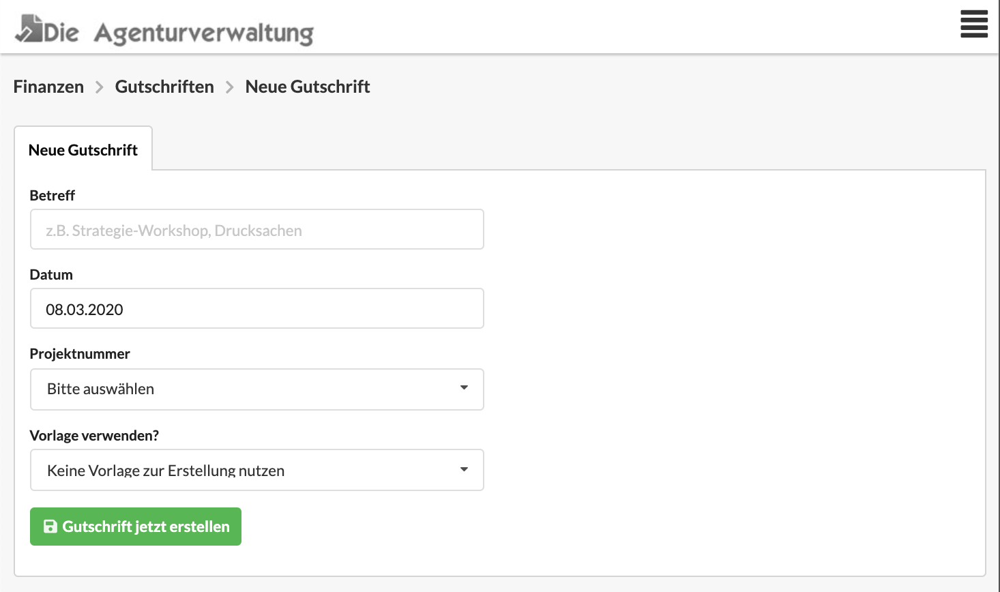

# Neue Gutschrift anlegen

Bei der Erstellung einer Gutschrift geben wir einen Betreff, ein Datum und eine Projektnummer an.

Eine neue Gutschrift kannt auf verschiedene Arten erstellt werden:

### Aus der Liste der Gutschriften

Im Menü unter Finanzen &gt; Gutschriften gelangst du zur Liste der Gutschriften. Rechts oberhalb der Liste befindet sich eine Schaltfläche "Neue Gutschrift".

### Aus einem Projekt

Im Reiter "Finanzen" eines Projekts findest Du alle bisher erstellen Gutschriften dieses Projekts. Oberhalb der Liste kann die Schaltfläche "Neue Gutschrift" genutzt werden.

### Aus einem Etat

Im Reiter "Finanzen" eines Etats findest Du alle bisher erstellen Gutschriften dieses Etats. Oberhalb der Liste kann die Schaltfläche "Neue Gutschrift" genutzt werden.

### Aus einem Kunden

Im Reiter "Finanzen" eines Kunden findest Du alle bisher erstellen Gutschriften dieses Kunden. Oberhalb der Liste kann die Schaltfläche "Neue Gutschrift" genutzt werden.

### Als Kopie aus einem anderen Dokument

Im Reiter "Optionen" eines Finanzdokuments kann im Abschnitt "Dokument kopieren" eine neue Gutschrift erzeugt werden, wenn als Zielformat "Gutschrift" ausgewählt wird.

### Aus einer Vorlage

Du kannst entweder ...

* ... beim Anlegen einer Gutschrift eine Vorlage auswählen, oder
* ... die Vorlage unter "Finanzen &gt; Vorlagen" öffnen, zum Reiter "Optionen" springen und dort eine Kopie der Vorlagen mit dem Zielformat "Gutschrift" erzeugen \(siehe oben\).

