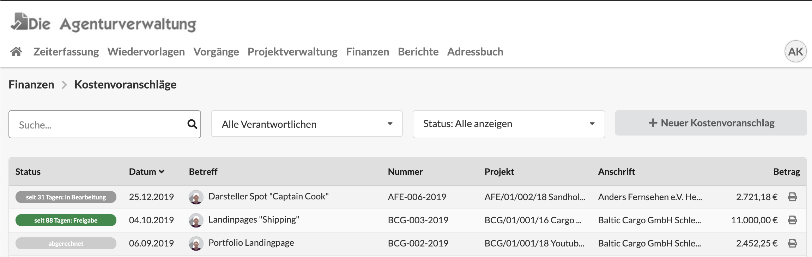
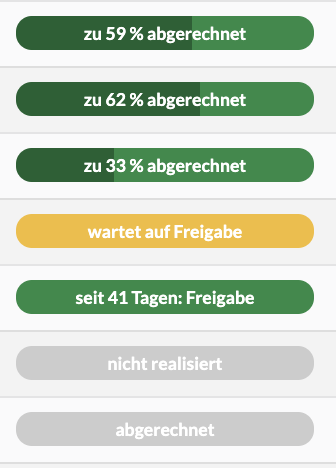

# Kostenvoranschläge

## Filter in der Kostenvoranschlagsliste

Die Liste der Kostenvoranschläge lässt sich über Filter oberhalb der Liste einschränken.

### Suche mit Wildcards \*

Die Suche erlaubt das Suchen nach Dokumentennummer, Projektnummer, Daten in der Anschrift und im Betreff des Dokuments.  
Mit dem Asterisk \(\*\) können auch Wildcard-Suchen durchgeführt werden im abgebildeten Beispiel kann ich z.B. durch die Eingab des Suchbegriffs `AFE*19`  Alle Dokumente finden in denen "AFE" gefolgt von "19" vorkommt. Wir hätten hier z.B. einen Suchtreffer beim ersten Dokument

### Suche nach Verantwortlichem

Über diesen Filter kann ein Nutzer ausgewählt werden und die Liste zeigt dann nur die Dokumente dieses Nutzers. Der Filter beinhaltet auch den Eintrag "Meine Kostenvoranschläge".

### **Suche nach Status**

Dieser Filter schränkt die Liste nach Dokumenten ein, die sich in einen bestimmten Status befinden.


FIltereinstellungen werden bis zur nächsten Anmeldung am System gespeichert.


## Diese Prozessschritte kann ein Kostenvoranschlag durchlaufen

#### in Bearbeitung

Dieses Dokument wird zur Zeit erstellt oder gerade geändert, es wird in keiner Auswertung mitberücksichtigt.

#### wartet auf interne Freigabe

Dieses Dokument ist fertiggestellt, wartet aber noch auf die Freigabe - z.B. durch einen Client Service Director bevor es an den Kunden gesendet werden kann.

#### wartet auf Versand

Dieses Dokument wurde intern überprüft und kann nun an den Kunden gesendet werden.

#### wartet auf Freigabe

Dieses Dokument wurde an den Kunden gesendet und wartet auf Feedback durch den Kunden.

#### Freigabe 

Dieser Kostenvoranschlag ist durch den Kunden freigegeben worden. Die Umsetzung kann starten. Das Budget des Dokuments wird dem Projektbudget zugerechnet sofern das Projekt nicht Geplante Budgets verwendet.

#### wartet auf Abrechnung

Die Umsetzung der Leistungen aus diesem Kostenvoranschlag ist abgeschlossen. Das Dokument kann abgerechnet werden.

#### abgerechnet

Die Schlussrechnung wurde zu diesem Kostenvoranschlag erstellt.

#### gegen Guthaben verrechnet 

Der Kostenvoranschlag wurde verrechnet, er gilt damit als abgerechnet.

#### nicht realisiert

Dieser Kostenvoranschlag wurde nicht realisiert. Dieser Status eignet sich wenn ein Kunde eine Änderung des Angebots wünscht. Der Projektleiter kann es dann auf "nicht realisiert" setzen, eine Kopie des Dokuments erzeugen, die gewünschten Änderungen vornehmen und es erneut an den Kunden senden. Auf diese Weise wird   
a\) der Fortschritt der Verhandlung dokumentiert  
b\) für jede Version eine neue eindeutige Nummer erzeugt damit es später keine Missverständnisse gibt welcher Teil des Angebots denn nun freigegeben war.


**Hinweis:** In deinem Unternehmen sind eventuell nicht alle Prozessschritte aktiviert. Sprich den Kundenservice an, wenn du daran etwas ändern möchtest: info@dieagenturverwaltung.de


In der Liste der Kostenvoranschläge kann auf einen Blick erkannt werden, in welchem Status sich ein Dokument befindet:

