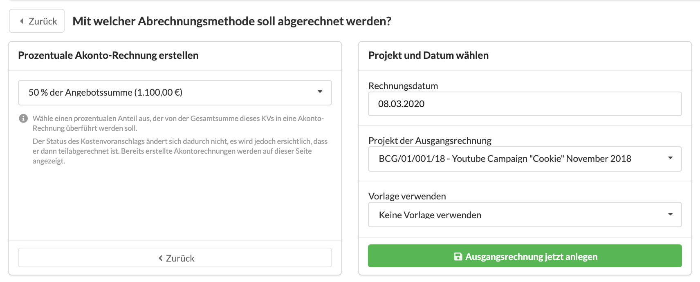
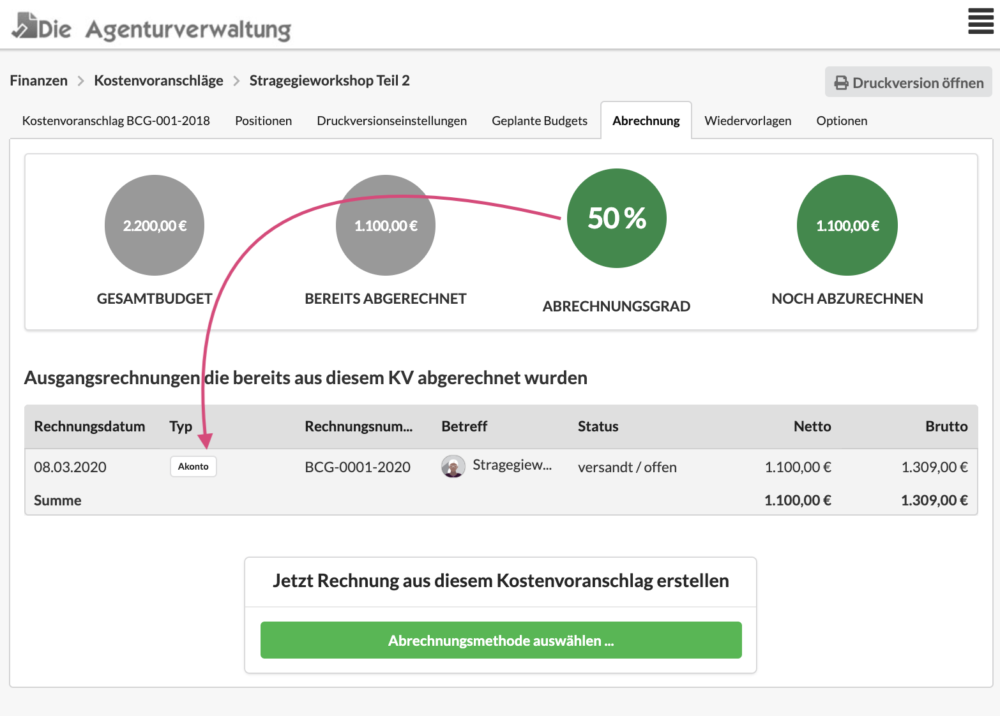

# Akonto-Rechnung erstellen

Die Agenturverwaltung bietet die Möglichkeit Akonto-Rechnungen direkt aus einem Kostenvoranschlag zu erzeugen.

## Was ist eine Akonto-Rechnung?

Akonto-Rechnungen sind Rechnungen für eine Abschlagszahlung des Kunden auf eine zu erbringende Leistung. Sie beziehen sich auf einen Kostenvoranschlag, in dem die Leistung definiert ist.

Sie sollten bei grösseren Kostenvoranschlägen ein bindender Teil des Angebots sein, es reicht hierzu in der Fußbemerkung des Kostenvoranschlags einen Vermerk in der Art "Wir berechnen 50% der Angebotssumme bei Freigabe" zu platzieren.


**Akonto-Rechnung bieten viele Vorteile**

a\) Sie nehmen den Kunden in die Pflicht, dadurch dass eine initiale Teilzahlung fällig wird, ist das Angebot formal unbestreitbar beauftragt

b\) Sie sind wichtig für den Erhalt der Liquidität deines Unternehmens

c\) Sie schützen dein Unternehmen und ggf. auch eure Lieferanten vor einem Totalausfall, falls euer Kunde beispielsweise während des Projektverlaufs Insolvenz anmelden muss.


Im Reiter "Abrechnung" des Kostenvoranschlags kann ich erkennen, ob bereits Ausgangsrechnungen aus diesem Kostenvoranschlag hervorgegangen sind.

## So erstellst Du eine Akontorechnung aus einem Kostenvoranschlag

Wähle im Reiter "Abrechnung" deines Kostenvoranschlags eine Abrechnungsmethode aus:

Entscheide dich entweder für eine Prozentuale Akontorechnung - z.B. 50 % der Angebotssumme - oder für einen Pauschalbetrag - z.B. 2000,- EUR:

Gib Anschliessend ggf. das gewünschte Rechnungsdatum  und - wenn abweichend vom Kostenvoranschlag - das Projekt an und klicke auf "Ausgangsrechnung jetzt anlegen".

Im Anschluss wird die Akontorechnung erzeugt.  
Kehrst Du nun zum Kostenvoranschlag zurück, ist im Reiter "Abrechnung" ersichtlich dass bereits ein Teilbetrag in Form einer Akonto-Rechnung abgerechnet wurde:

