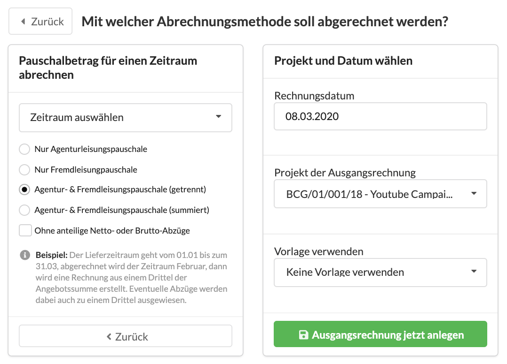
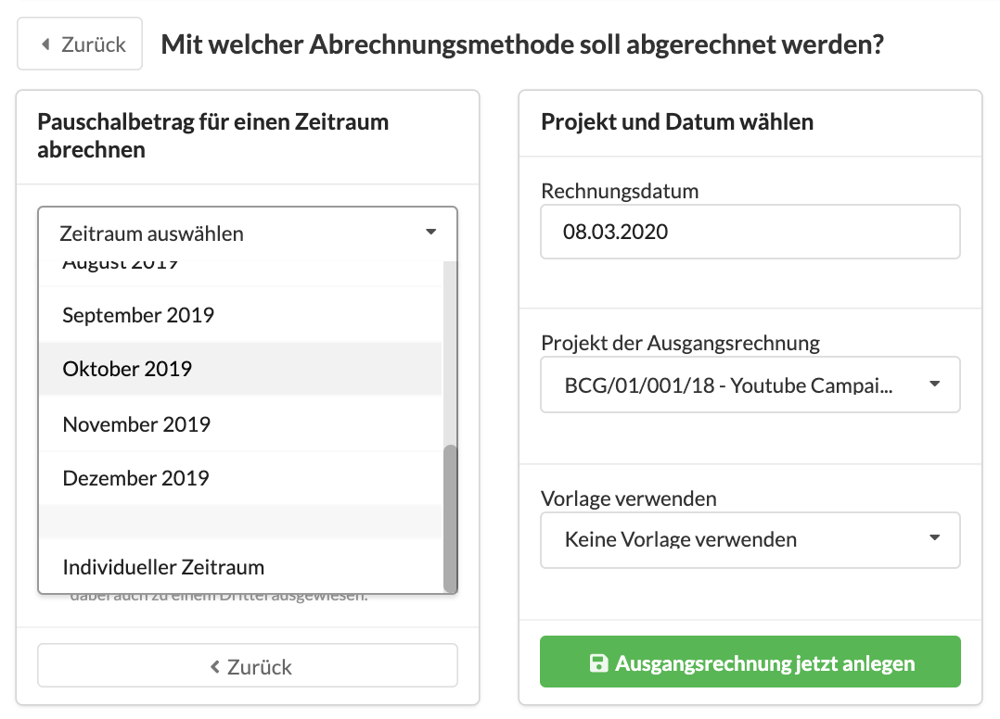

# Periodische Teilabrechnung \(Retainer\)

## Was ist eine Periodisch Teilabrechnung?

Angenommen ihr habt einen Beratungsvertrag mit einem Kunden abgeschlossen, der über ein Jahr läuft und bei dem vereinbart wurde, dass monatlich ein Zwölftel der Agentur- und Fremdleistung abgerechnet werden.   
Zusätzlich habt ihr dem Kunden einen Rabatt von 1.000 EUR gewäht.  
Wenn ihr dann eine der monatlichen Rechnungen erzeugt, möchtet ihr  
a\) ein Zwölftel der Agentur- und Fremdleistung abrechnen  
b\) ein Zwölftes des gewährten Rabatts in die Ausgangsrechnung übernehmen


Für die periodisch Abrechnung spielt der Lieferzeitraum des Kostenvoranschlags eine zentrale Rolle. In unserem Beispiel gehen wir von einem Lieferzeitraum von 01.01 bis 31.12 aus.

Den Lieferzeitraum stellst Du im ersten Reiter deines Kostenvoranschlags ein.


## So erzeugst du eine periodische Teilabrechnung

Wähle im Reiter "Abrechnung" des Kostenvoranschlags eine Abrechnungsmethode aus:

Entscheide dich im nächsten Schritt für "Pauschalbetrag für einen Zeitraum abrechnen".

Wähle anschliessend einen Zeitraum aus:

Du kannst einen Monat aus dem Leistungszeitraum deines Kostenvoranschlags auswählen oder einen freien Zeitraum angeben.


**Hinweis**  
Es macht einen rechnerischen Unterschied ob du hier "01.03.2019" bis "31.03.2019" auswählst oder einfach "März 2019".  
Beim "Individueller Zeitraum" werden in diesem Beispiel 31 Tage abgerechnet, beim "Monat März 2019" jedoch ein Zwölftel der Angebotssumme aus unserem Beispiel. Wenn der Lieferzeitraum eines Kostenvoranschlag mehrere Monate überspannt, haben alle mit dieser Abrechnungsmethode erzeugten **Monatsrechnungen** die **gleiche Summe**, obwohl die Monate unterschiedlich lang sind \(28, 29, 30 oder 31 Tage\).  
Bei einem Lieferzeitraum von z.B. secheinhalb Monaten \(01.01. bis 15.07\) werden die ersten 6 Rechnungen gleichmässig verteilt und der halbe Juli wird ganz am Schluss abgerechnet.


Gib Anschliessend ggf. das gewünschte Rechnungsdatum  und - wenn abweichend vom Kostenvoranschlag - das Projekt an und klicke auf "Ausgangsrechnung jetzt anlegen".

