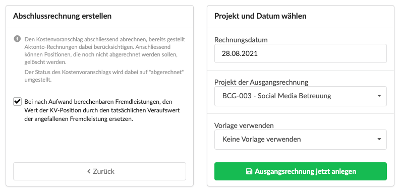

# Schlussrechnung erstellen

## Was ist eine Schlussrechnung?

Die Schlussrechnung ist das letzte Ausgangsrechnungsdokument das aus einem Kostenvoranschlag erzeugt wird. Er gilt im Anschluss als abgerechnet.

Eine Schlussrechnung kann als erste Rechnung aus einem Kostenvoranschlag erzeugt werden oder als letzte in einer Serie von Akonto- oder Teilleistungsrechnungen.


Die Schlussrechnung führt alles Leistungen des Kostenvoranschlags noch einmal auf und bringt automatisch alle zuvor aus diesem Kostenvoranschlag erzeugten Akonto-, oder Teilleistungsrechnungen zum Abzug.


## So erzeugst Du eine Schlussrechnung

Wähle im Reiter "Abrechnung" deines Kostenvoranschlags eine Abrechnungsmethode aus:

Es werden verschiedene Abrechnungsmethoden vorgeschlagen, wähle hier "Abschlussrechnung erstellen" aus.

Gib Anschliessend ggf. das gewünschte Rechnungsdatum  und - wenn abweichend vom Kostenvoranschlag - das Projekt an und klicke auf "Ausgangsrechnung jetzt anlegen".

### Abrechnung von angefallenen Fremdleistungen

Das Häkchen beim Erstellen der Abrechnung erlaubt uns, die Summen bestimmter Positionen automatisch anzupassen, wenn Fremdleistungen "nach Aufwand berechenbar" sind.


**Anwendungsbeispiel**  
Wir haben in einer Kostenvoranschlagsposition "Reisekosten" 500,- EUR kalkuliert, mit dem Kunden jedoch vereinbart, dass wir die Reisekosten nach Beleg - also so wie sie anfallen - abrechnen.

Bei der Reise fallen zwei Belege an: Ein Ticket für eine Bahnfahrt \(200,- EUR\) sowie ein Beleg für eine Übernachtung in einem Hotel \(150,- EUR\).  
Insgesamt sind also 350,- EUR gegen die Position "Reisekosten" angefallen.  
  
Wenn ich das Häkchen bei der Erstellung der Schlussrechnung also aktiviert lasst, ändert sich der Wert der Position "Reisekosten" also automatisch auf 350,- EUR, die Summe der gegen diese Position angefallenen _nach Aufwand berechenbaren_ Fremdleistungen.


## Statuswechsel des Kostenvoranschlags bei der Abrechnung

Bei der Erzeugung einer Schlussrechnung ändert sich der Status des Kostenvoranschlags von "Freigabe" automatisch auf "abgerechent".

