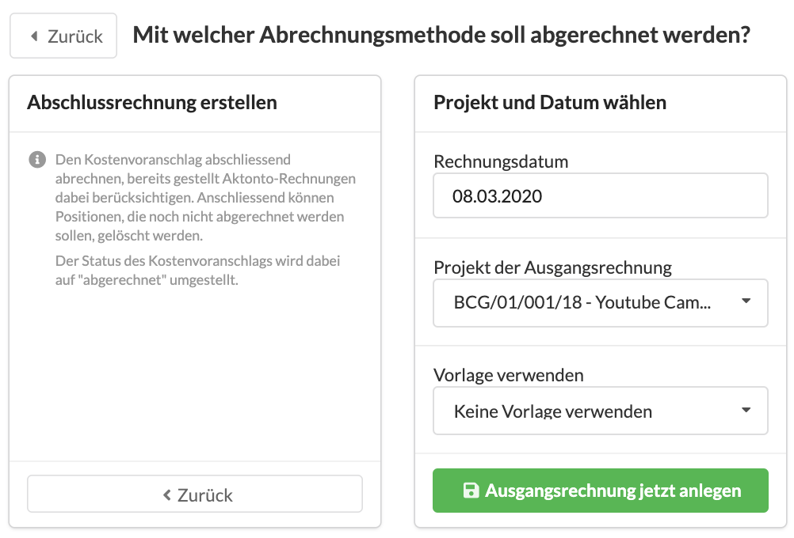

# Schlussrechnung erstellen

## Was ist eine Schlussrechnung?

Die Schlussrechnung ist das letzte Ausgangsrechnungsdokument das aus einem Kostenvoranschlag erzeugt wird. Er gilt im Anschluss als abgerechnet.

Eine Schlussrechnung kann als erste Rechnung aus einem Kostenvoranschlag erzeugt werden oder als letzte in einer Serie von Akonto- oder Teilleistungsrechnungen.


Die Schlussrechnung führt alles Leistungen des Kostenvoranschlags noch einmal auf und bringt automatisch alle zuvor aus diesem Kostenvoranschlag erzeugten Akonto-, oder Teilleistungsrechnungen zum Abzug.


## So erzeugst Du eine Schlussrechnung

Wähle im Reiter "Abrechnung" deines Kostenvoranschlags eine Abrechnungsmethode aus:

Es werden verschiedene Abrechnungsmethoden vorgeschlagen, wähle hier "Abschlussrechnung erstellen" aus.

Gib Anschliessend ggf. das gewünschte Rechnungsdatum  und - wenn abweichend vom Kostenvoranschlag - das Projekt an und klicke auf "Ausgangsrechnung jetzt anlegen".

## Statuswechsel des Kostenvoranschlags bei der Abrechnung

Bei der Erzeugung einer Schlussrechnung ändert sich der Status des Kostenvoranschlags von "Freigabe" automatisch auf "abgerechent".

