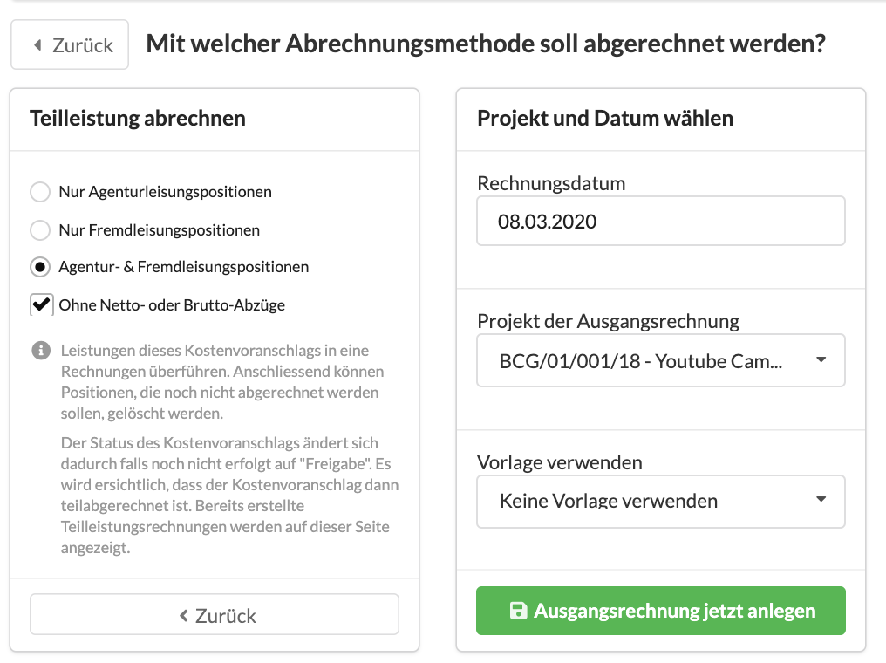

# Teilleistungsrechnung erstellen

Die Agenturverwaltung unterstützt die Erstellung von Teilleistungsrechnungen aus einem Kostenvoranschlag.

## Was ist eine Teilleistungsrechnung?

Teilleistungsrechnungen werden gestellt wenn bestimmte Teile eines Angebots geliefert wurden. Im Gegensatz zur Akonto-Rechnung, bei der es sich um einen leistungsneutralen Abschlag handelt, ist bei der Teilleistungsrechnung bereits eine Leistung geliefert worden.

## So erstellst du eine Teilleistungsrechnung

Gehe zum Reiter "Abrechnung" deines Kostenvoranschlags und wähle eine Abrechnungsmethode aus:

Anschliessend werden dir verschiedene Abrechnungsmethoden vorgeschlagen. Wähle hier "Teilleistung abrechnen" aus.

Du hast nun verschiedene Möglichkeiten:

#### Nur Agenturleistungspositionen abrechnen

Es wird eine Ausgangsrechnung mit den gleichen Positionen wie im Kostenvoranschlag erzeugt, jedoch ohne dabei Fremdleistungspositionen aus dem Kostenvoranschlag zu übernehmen.

#### Nur Fremdleistungspositionen abrechnen

Es wird eine Ausgangsrechnung mit den gleichen Positionen wie im Kostenvoranschlag erzeugt, jedoch ohne dabei Agenturleistungspositionen aus dem Kostenvoranschlag zu übernehmen.

#### Agentur- und Fremdleistungspositionen abrechnen

Es wird eine Ausgangsrechnung mit den gleichen Positionen wie im Kostenvoranschlag erzeugt, Du kannst anschliessend selbst entscheiden, welche Positionen du entfernen möchtest.

#### Netto- oder Brutto-Abzüge nicht in der Teilleistungsrechnung berücksichtigen

Um zu verhindern, dass Netto-Abzüge doppelt - nämlich jetzt in der Teilleistungsrechnung und später in der Schlussrechnung - berücksichtigt werden, können wir sie bei der Erstellung der Teilleistungsrechnung ignorieren. 


Achte hier darauf, dass die Teilleistungsrechnung ohne die Abzüge nicht höher ausfällt als der Kostenvoranschlag.


Gib Anschliessend ggf. das gewünschte Rechnungsdatum  und - wenn abweichend vom Kostenvoranschlag - das Projekt an und klicke auf "Ausgangsrechnung jetzt anlegen".

## Kein Statuswechsel des Kostenvoranschlags bei der Abrechnung

Bei der Erzeugung einer Teilleistungsrechnung verbleibt der Status des Kostenvoranschlags auf "Freigabe". Erst die Erstellung einer Schlussrechnung aus dem KV wird dieser automatisch auf "abgerechent" umgestellt.

