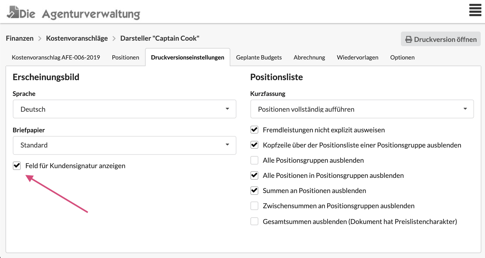
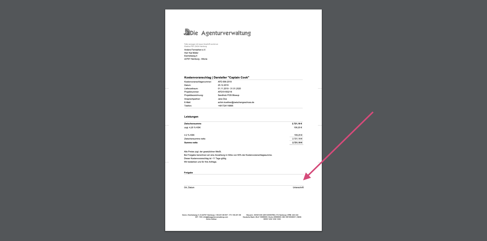

# Druckversionseinstellungen

Allgemeines zu Druckversionseinstellungen erfährst du hier:



## Unterschriftsfeld für die Freigabe

Bei Kostenvoranschlägen kann zusätzlich ein Unterschriftsfeld für die Freigabe-Unterschrift des Kunden unten in der Druckversion des Dokuments ausgegeben werden.

In der Druckversion wird dann folgender Abschnitt ergänzt:

