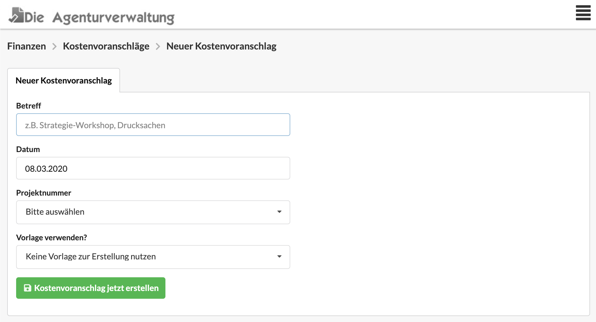
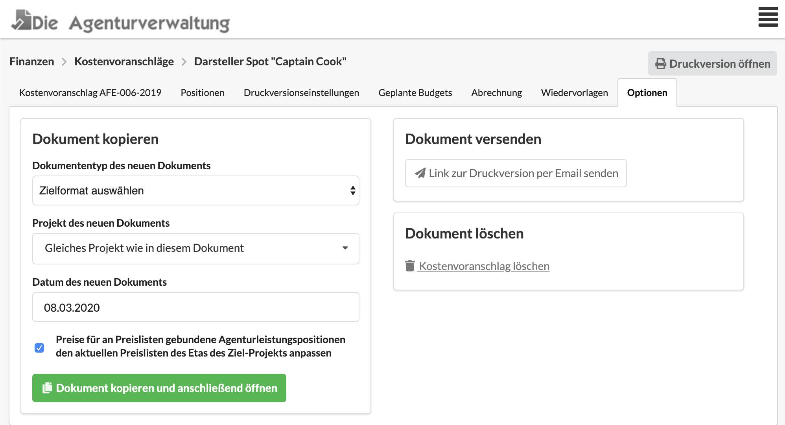

# Neuen Kostenvoranschlag erstellen

Bei der Erstellung eines Kostenvoranschlags geben wir einen Betreff, ein Datum und eine Projektnummer an.

In manchen Unternehmen kann - je nach Konfiguration - die Projektnummer auch freigelassen werden, weil das Projekt erst angelegt wird, wenn der Kostenvoranschlag freigegeben wird.

Ein neuer Kostenvoranschlag kannt auf verschiedene Arten erstellt werden:

### Aus der Kostenvoranschlagsliste

Im Menü unter Finanzen &gt; Kostenvoranschläge gelangst du zur Liste der Kostenvoranschlage. Rechts oberhalb der Liste befindet sich eine Schaltfläche "Neuer Kostenvoranschlag".

### Aus einem Projekt

Im Reiter "Finanzen" eines Projekts findest Du alle bisher erstellen Kostenvoranschläge dieses Projekts. Oberhalb der Liste kann die Schaltfläche "Neuer Kostenvoranschlag" genutzt werden.

### Aus einem Etat

Im Reiter "Finanzen" eines Etats findest Du alle bisher erstellen Kostenvoranschläge dieses Etats. Oberhalb der Liste kann die Schaltfläche "Neuer Kostenvoranschlag" genutzt werden.

### Aus einem Kunden

Im Reiter "Finanzen" eines Kunden findest Du alle bisher erstellen Kostenvoranschläge dieses Kunden. Oberhalb der Liste kann die Schaltfläche "Neuer Kostenvoranschlag" genutzt werden.

### Als Kopie aus einem anderen Dokument

Im Reiter "Optionen" eines Finanzdokuments kann im Abschnitt "Dokument kopieren" ein neuer Kostenvoranschlag erzeugt werden, wenn als Zielformat "Kostenvoranschlag" ausgewählt wird.



### Aus einer Vorlage

Du kannst entweder ...

* ... beim Anlegen eines Kostenvoranschlags eine Vorlage auswählen, oder
* ... die Vorlage unter "Finanzen &gt; Vorlagen" öffnen, zum Reiter "Optionen" springen und dort eine Kopie der Vorlagen mit dem Zielformat "Kostenvoranschlag" erzeugen \(siehe oben\).

