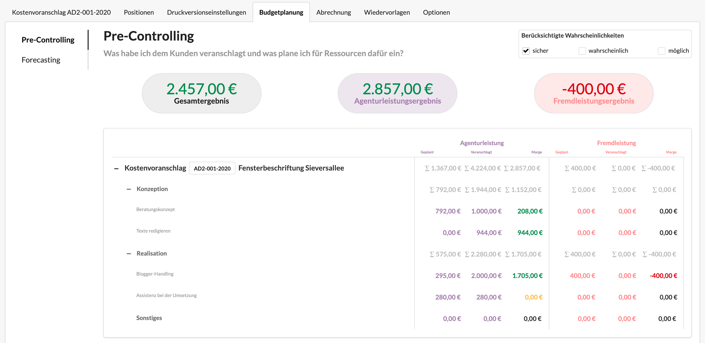

# Budgetplanung

Geplante Budgets für Agentur- und Fremdleistung können auch am Kostenvoranschlag definiert werden. Sie verhalten sich genau so wie am Projekt.



Gehört der Kostenvoranschlag zu einem Projekt, werden die Geplanten Budgets des Kostenvoranschlags auch im Projekt mit angezeigt.

Gehört der Kostenvoranschlag noch keinem Projekt an und wird später einem Projekt zugeordnet, so werden die Geplanten Budgets des Kostenvoranschlags automatisch mit ins Projekt übernommen. Das gleiche passiert, wenn der Kostenvoranschlag später einem anderen Projekt zugeordnet wird.

## Anwendungsszenarien

Habe ich die Budgets für Agentur- und Fremdleistungen im Reiter "Geplante Budgets" meines Projekts auf "Geplante Budgets" umgestellt, zeigt mir der Report meines Projekts für meine Agenturleistungs-, Arbeitszeit- und Fremdleistungsbudgets die Werte als Summe an, die ich hier am Kostenvoranschlag im Reiter "Geplante Budgets" hinterlegt habe.


Ich kann auf diese Weise das verfügbare Agentur- und Fremdleistungsbudget meines Teams definieren, unabhängig davon, zu welchem Preis ich die Leistung dem Kunden angeboten habe.


Selbst wenn in einem Projekt nicht die Geplanten Budgets sondern die im Kostenvoranschlag kalkulierten Agentur- und Fremdleistungen berücksichtigt werden, kann es Sinn machen, die Geplanten Budgets des KVs zu dokumentieren bevor der Kostenvoranschlag erstellt wird.

Auf diese Weise wird klar, welche Aufwände mit der Umsetzung des Kostenvoranschlags anfallen werden und die Preisgestaltung des Angebots wird dadurch leichter.

