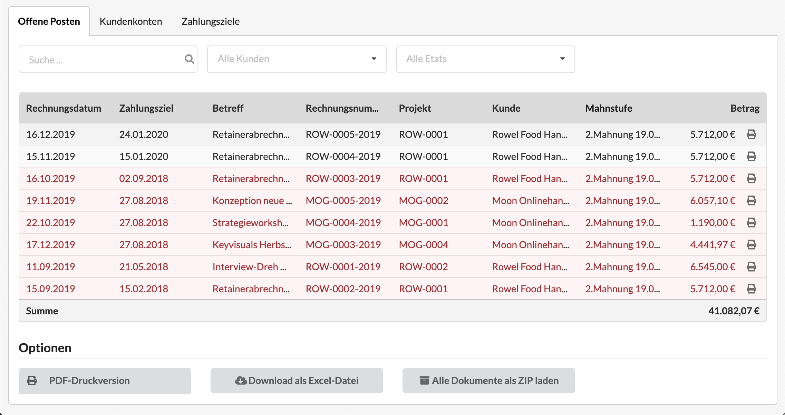
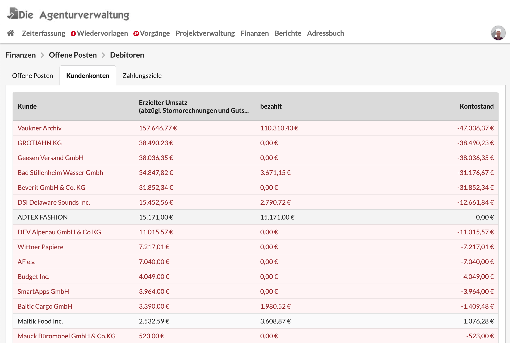

# Offene Posten

## Debitoren

### Offene Posten - alle offenen Rechnungen auf einen Blick

Die Debitorenliste kann über das Hauptmenü "Finanzen &gt; Debitoren"  aufgerufen werden. Hier finden wir alle offenen - d.h. **unbezahlten** - Rechnungen an unsere Kunden. Ist das Zahlungsziel einer Rechnung überschritten \(es kann in der Rechnung im Reiter "Zahlung" eingestellt werden\), wir die Rechnung rot markiert.

Unterhalb der Liste befinden sich Exportfunktionen, es kann beispielsweise eine Liste der Offenen Posten als PDF erstellt werden, oder ein ZIP-Archiv mit allen hier angezeigten PDF-Rechnungen erstellt werden.


**Tipp: Eine Liste aller offenen Rechnungen an einen Kunden senden**  
Wenn im Kundenfilter oberhalb der Liste ein bestimmter Kunde ausgewählt wird, erscheinen nur die an diesen Kunden gestellten offenen Rechnungen. So lässt sich ein PDF mit einer Liste der offenen Rechnungen dieses Kunden für den Kunden erstellen und z.B. dem nächsten Schreiben beilegen.  
Es ist dabei möglich in der Druckversion alle offenen Rechnung oder nur die überfälligen offenen Rechnungen aufzuführen.


### Kundenkonten - wieviel ist bei welchem Kunden noch offen?

Diese nach Umsatz sortierte Kundenliste zeigt zum einen welcher Kunde den meisten Umsatz beiträgt, zum anderen was an ihn berechnet, und was davon bereits bezahlt wurde. Daraus ergibt sich der Saldo im Kundenkonto.

### Zahlungsziele - wie schnell zahlen die Kunden im Vergleich?

Das hier ermittelte Zahlungsziel je Kunde ist ein Durchschnittswert aus der Differenz zwischen Rechnungsdatum und Zahlungseingang.

Sind 0 Tage angegeben liegen für diesen Kunden noch keine Daten vor.

## Kreditoren

In dieser Liste finden sich alle an unser Unternehmen adressierten Lieferantenrechnungen, die im System bereits erfasst, jedoch noch nicht bezahlt wurden.

Die Liste verfügt unterhalb über eine Druckversion sowie eine Export-Möglichkeit als Spread-Sheet für Tabellenkalkulationsprogramme.


**Tipp**: Über den Lieferantenfilter oberhalb der Liste kann beispielsweise eine Druckversion mit allen offenen Rechnung eines einzelnen Lieferanten erstellt werden.


