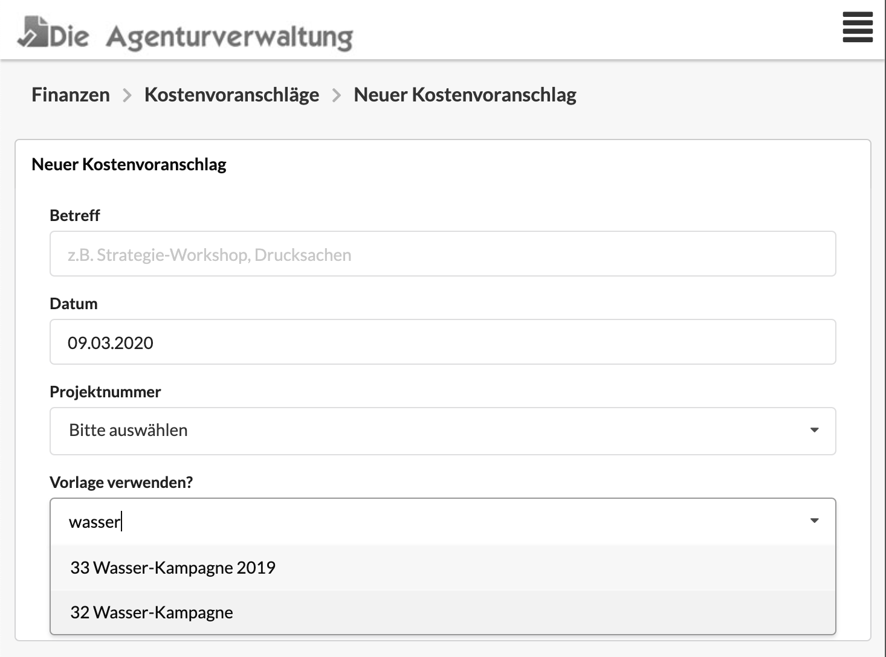
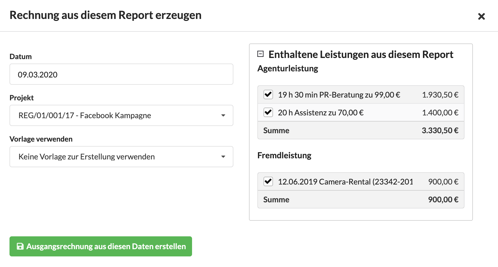
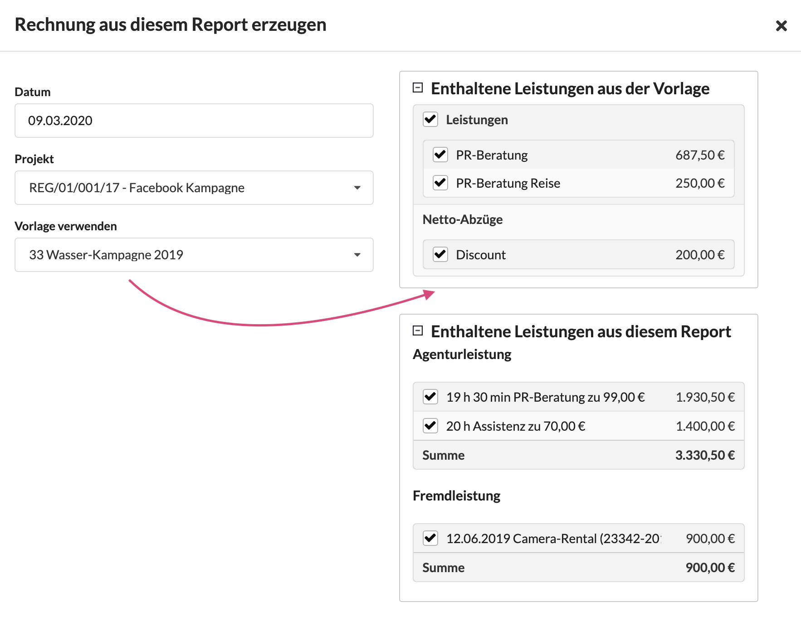
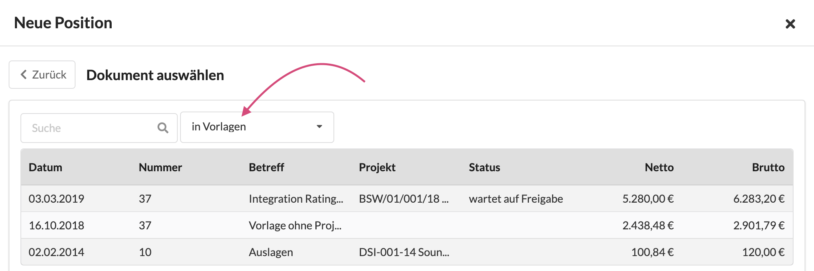
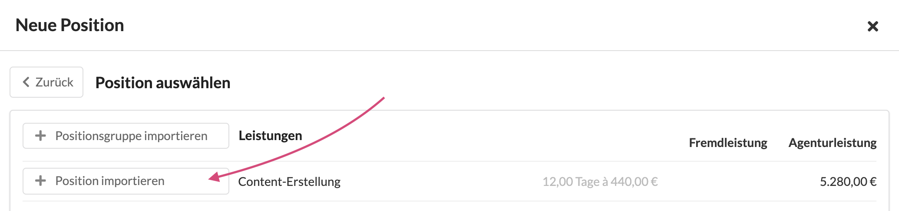

# Vorlagen verwenden

## Beim Anlegen eines Finanzdokuments

Wird ein neues Dokument angelegt, kann eine Vorlage ausgewählt werden. Aus der Vorlage werden - sofern in der Vorlage definiert - Kopf- und Fussbemerkungen, zusätzliche Tabellarische Felder, Positionen, Abzüge und - beim Erstellen einer Ausgangsrechnung - der Umsatzsteuersatz in das neue Dokument übernommen.

## Bei der Abrechnung eines Projektreports

Wenn wir im Reiter "Report" eines Kunden, Etats oder Projekts eine Rechnung aus einem Report erzeugen, werden uns die angefallenen Leistungen aus dem Report angezeigt.

Wählen wir nun eine Vorlage aus, kommen auch Positionen aus der Vorlage zu unserer Abrechnung hinzu:

An dieser Stelle haben vor der Erstellung der Rechnung noch die Möglichkeit, bestimmte Positionen oder Abzüge aus der Vorlage zu deaktiveren. Sie werden dann nicht mit in unserer Ausgangsrechnung übernommen. 

## Beim Erstellen einer Position in einem Finanzdokument

Wenn in einem Finanzdokument eine neue Position angelegt wird, können wir uns entscheiden ob wir manuell eine Agentur- oder Fremdleistung erzeugen oder eine Position importieren.

Im Anschluss werden mir eine Liste von Finanzdokumenten vorgeschlagen, in der ich Suchen kann.  
Wenn im Filter oben "in Vorlagen" auswählen, enthält die Liste nur noch unsere Vorlagen.

Anchliessend wähle ich hier eine Vorlage aus und entscheide mich für den Import einer ganzen Positionsgruppe \(hier heisst die Gruppe "Leistungen"\) oder für eine einzelne Position.


Dieses Verfahren ist sinnvoll wenn euer Unternehmen einen Preiskatalog als Vorlage führt aus dem sich die Projektmanager beim Erstellen von Kostenvoranschlägen bedienen können.


