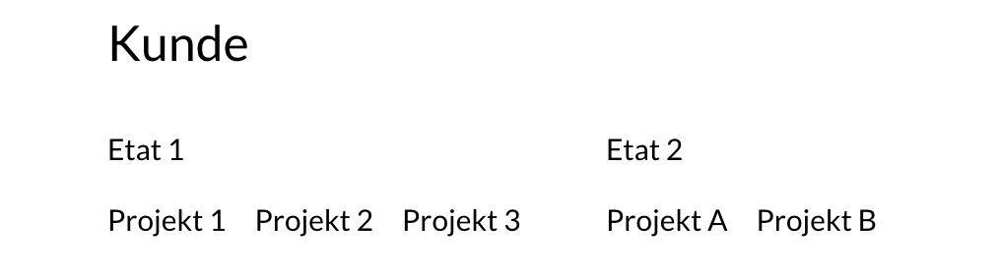

# Projektverwaltung

Die Projektverwaltung ist die operative Schaltzentrale der Agenturverwaltung. In der Projektverwaltung findet sowohl die Planung, als auch die Erfassung von Agentur- und Fremdleistungen sowie die Abrechnung statt.

Wir haben ein kurzes Video erstellt, um die **wichtigsten Begriffe** zu erklären. Solltet ihr die Inhalte lieber lesen wollen, findet ihr alle Informationen weiter unten auf dieser Seite.



### Die wichtigsten Begriffe zur Verwaltung von Projekten

In der Agenturverwaltung können **Projekte** angelegt werden. Mit Projekten organisieren wir **Aufträge unserer Kunden**.

Die Agenturverwaltung führt **zwischen Kunde und Projekt** noch eine Zwischenebene, den **Etat**. In einem Kunden kann es also mehrere Etats mit verschiedenen Projekten geben.

Ihr fragt euch, warum es die Etat-Ebene in der Agenturverwaltung gibt? Die Antwort erfahrt ihr auf folgender Seite:


[etats](etats/)


### Was wird an einem Projekt alles verwaltet?

Zunächst einmal das mit dem Kunden vereinbarte Budget für das Projekt.

Im Verlauf des Projekts fallen Kosten an. Das sind zum Einen **Fremdleistungen**, also Leistungen externer Dienstleister und Lieferanten. Zum Anderen **Agenturleistungen**, also Leistungen die die Mitarbeiter der Agentur in die Zeiterfassung eingeben.

Agentur- und Fremdleistungen repräsentieren im Projekt also die **Kosten**, der **Umsatz** trägt zu den **Erlösen** bei.

### Budget

Das schauen wir uns jetzt noch einmal genauer an. Ein **Budget** kann entweder einem oder mehreren Kostenvoranschlägen des Projekts entstammen oder einem sogenannten "Geplanten Budget".


Ein** Geplantes Budget** wird dann am Projekt vermerkt wenn es im Projekt **keinen Kostenvoranschlag** gibt, oder dieser nicht der tatsächlichen Planung entspricht. Das kann verschiedene Gründe haben:

1. Der Auftrag wurde formlos erteilt z.B. telefonisch&#x20;
2. Der Kostenvoranschlag umreisst ein Budget welches wir nicht voll ausreizen möchten, z.B. weil wir mit den letzten drei Projekten dieses Kunden Geld verloren haben
3. Der Kostenvoranschlag liegt auf einem anderen Projekt. Wenn es z.B. nur einen Kostenvoranschlag für ein ganzes Jahr gab, die anfallenden Leistungen aber auf verschiedenen Projekten erfasst werden, hinterlegt man in den einzelnen Projekten einen entsprechenden Budgetrahmen mit "geplanten Budgets".


### **Umsatz**

**Umsatz** resultiert in einem Projekt aus einer **Ausgangsrechnung**. Das können eine oder mehrere Akonto-Rechnungen - also Anzahlungsrechnungen - sein, oder eine Schlussrechnung, die die ggf. zuvor gestellten Akonto-Rechnungen zum Abzug bringt.

### Agenturleistung

**Agenturleistungen** ergeben sich aus der Zeiterfassung. \
Zu einem **Zeiterfassungseintrag** gehört mindestens Folgendes:&#x20;

1. welcher Mitarbeiter hat Zeit erfasst?&#x20;
2. Welche Dauer wurde an welchem Tag erfasst?
3. in welcher Funktion - z.b: Grafik-Design, Beratung, Programmierung - wurde Zeit erfasst?&#x20;
4. Auf welchem Projekt wurde die Zeit erfasst

### Fremdleistung

**Fremdleistungen** entsprechen externen Kosten, die auf unseren Projekten anfallen. Diese Kosten entstammen Eingangsrechnungen die unsere Lieferanten uns stellen. Wir bekommen also von einem externen Dienstleister eine Rechnung und können diese dann auf eins unserer Projekte buchen. Dabei ist es explizit möglich auch nur einen Teilbetrag auf das Projekt zu verbuchen. Die monatliche Rechnung eins Lektoratsbüros kann so z.B. anteilig auf verschiedene Projekte verteilt werden.

Zu einer Fremdleistung gehört ein Einkaufswert und ein Verkaufswert - in den meisten Fällen sind diese identisch, es lassen sich hier aber auch Margen abbilden. Der Abrechnungszeitpunkt beschreibt zu welchem Datum die Fremdleistung auf das Projekt fällt.

### Wie sieht ein einfacher Projektverlauf aus?

Uns ist bewusst, dass kein Projekt einem anderen gleicht. Eine High-Level-Darstellung eines klassischen Projektverlaufs sieht allerdings häufig wie folgt aus:

1. Projekt anlegen
2. KVA erstellen
3. Akonto-Rechnung erstellen
4. Arbeitszeit erfassen
5. Fremdleistungen erfassen
6. Abschlussrechnung erstellen

Mit der Agenturverwaltung lassen sich aber auch andere Projekttypen wie z.B. **Retainer-Vereinbarungen** abbilden, bei denen ein Budget über einen längeren Zeitraum beispielsweise monatlich abgerechnet wird.
