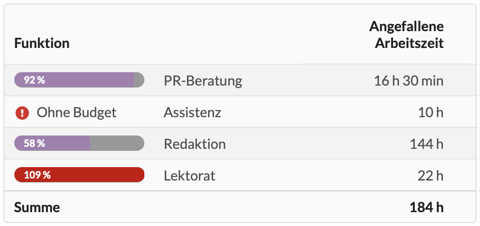
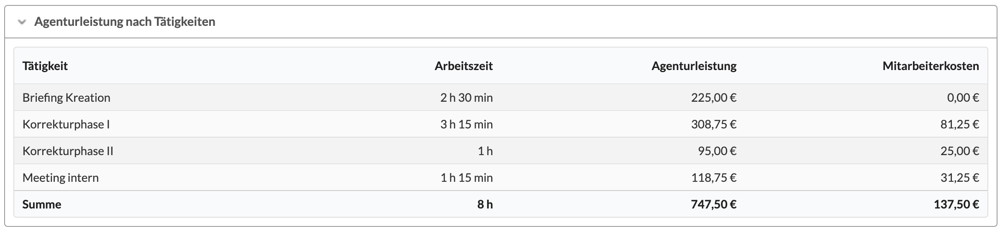
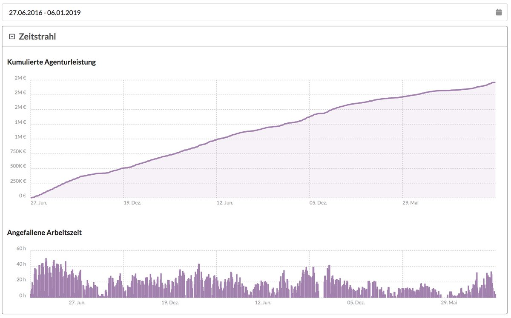

# Agenturleistungen in der Projektverwaltung

Auf den drei Hierarchieebenen der Projektverwaltung \(Kunde, Etat und Projekt\) könnt ihr in dem Reiter "**Agenturleistung**" diverse Auswertungen bezüglich der budgetierten und angefallenen Agenturleistungsaufwände eines Kunden, Etats oder Projekts durchführen.

## Die Funktionen im Überblick

Beim Aufruf des Reiters "Agenturleistung" seht ihr einen übergeordneten Filter und fünf Arten der Auswertung.

## Zeitliche Einschränkung

Alle Werte dieses Berichts beziehen sich ggf. auf den oben ausgewählten Leistungszeitraum.

## Agenturleistung nach Funktionen

Wurden Funktionen im KV oder in Geplanten Budgets vorgegeben, können wir an dieser Stelle erkennen, wieviel des Budgets in einer bestimmten Funktion bereits verbraucht wurde. So lässt sich auch ggf. gleich zu Anfang im Verlauf eines Projekts eine Budgetüberziehung erkennen, obwohl das Gesamtbudget des Projekts noch ausreichend zu sein scheint.

## Agenturleistung nach Tätigkeiten

Diese Auswertung erlaubt die Betrachtung von erfassten Arbeitszeiten nach Tätigkeiten.

Mehr zu Tätigkeiten in der Zeiterfassung:



## Agenturleistung nach Mitarbeitern

In dieser Tabelle werden erfasste Zeiten kumuliert nach Mitarbeiter aufgeführt.

## Agenturleistung nach KV-Position

Wurden bestimmte KV-Positionen für die Zeiterfassung aktiviert,  kann an dieser Stelle ausgewertet werden wieviel Agenturleistungen an den jeweiligen Positionen erfasst wurde und wieviel Budget ihnen gegenübersteht.

## Agenturleistung nach Vorgängen

Wurden bestimmte Vorgänge innerhalb von Projekten für die Zeiterfassung aktiviert,  kann an dieser Stelle ausgewertet werden wieviel Agenturleistungen an den jeweiligen Vorgängen erfasst wurde.

## Zeitstrahl

In diesem Chart kann auf einen Blick erkannt werden, wann sich etwas auf einem Projekt getan hat.

