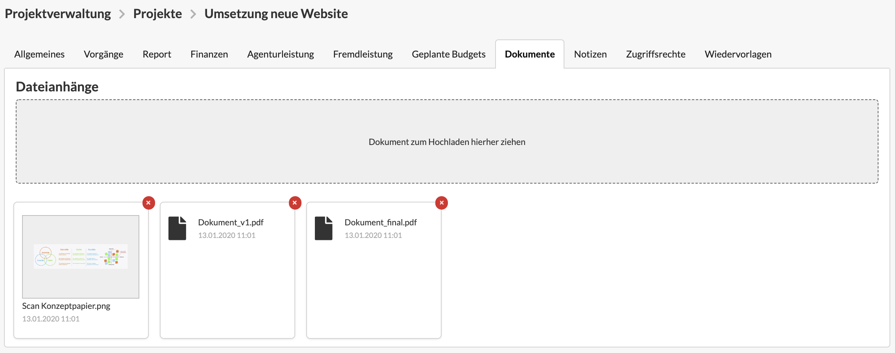

# Dokumentenablage in der Projektverwaltung

Auf den drei Hierarchieebenen der Projektverwaltung \(Kunde, Etat und Projekt\) könnt ihr im Reiter "Dokumente" für den jeweiligen Datensatz relevante **Dokumente hochladen und mit eurem Team teilen.**

Dazu könnt ihr eine Datei einfach per Drag&Drop oder durch Klick auf die graue Box hochladen.

Hochgeladene Dokumenten erscheinen dann unterhalb der Box und können durch ein Klick geöffnet oder heruntergeladen werden. Die Dokumente können von allen Benutzern mit einer entsprechenden Berechtigung eingesehen und bearbeitet werden. 


Die Dokumente sind nicht auf den verknüpften Hierarchieebenen einsehbar.   
Das heißt, ein am Projekt hochgeladenes Dokument ist nicht im verknüpften Etat oder in anderen Projekten des Etats sichtbar.


### Ihr seht den Reiter "Dokumente" nicht?

Der Zugriff auf die Dokumente in Projekt, Etat und Kunde kann in den Berechtigungseinstellungen unter Einstellungen an einem spezifischen Benutzer oder an einer Benutzergruppe konfiguriert werden. Detaillierte Informationen zu den Berechtigungseinstellungen findet ihr hier:



