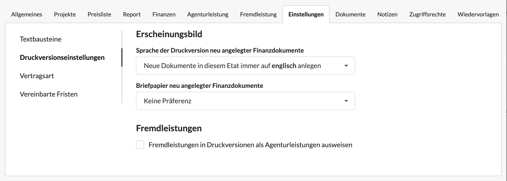

# Etat-spezifische Druckversionseinstellungen

## Alternative Druckversionseinstellungen für Finanzdokumente

Am Etat kann definiert werden, dass für alle Dokumente die in diesem Etat angelegt werden, standardmässig ein bestimmtes Briefpapier, oder wie im Beispiel hier die Dokumentensprache "englisch" verwendet wird.

