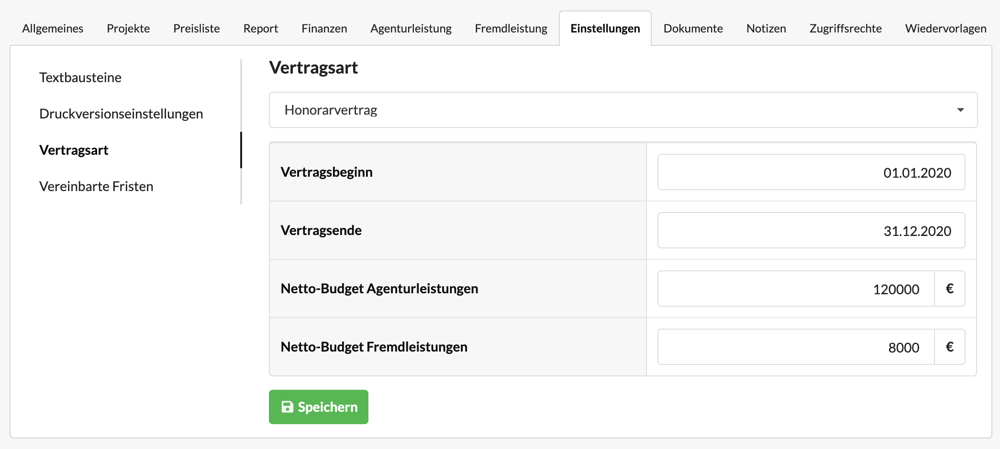

# Projekt- und Honorarverträge konfigurieren

## Vertragsarten

Besteht ein Etat aus mehreren Projekten, die alle unabhängig voneinander angeboten und abgerechnet werden, die in ihrer Gesamtheit jedoch in einen Vertragsrahmen fallen, kann an dieser Stelle **Honorarvertrag** ausgewählt werden. Ein Honorarvertrag verfügt über einen Zeitraum sowie ein Budget für Agentur- und Fremdleistungen.

Die Bugets von Honorarverträgen können mit den angefallenen Leistungen auf den Projekten eines Honorarvertragsetats in der Ansicht "Auswertung Honorarverträge" gegenübergestellt werden. 

