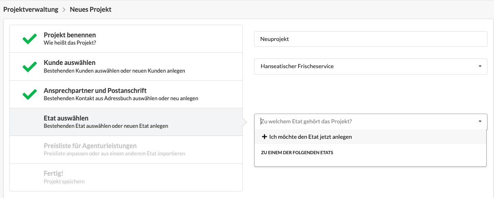

# Neuen Etat anlegen

Wie in der Einführung beschrieben, befindet sich die Etat-Ebene logisch zwischen dem Kunden und den Projekten des Kunden und verwaltet die Preisliste.&#x20;

Spätestens bei Erstellung eines Projekts für einen neuen Kunden erstellen wir einen Etat. Alternativ kann ein Etat auch in der Kunden-Detailansicht oder unter _Projektverwaltung > Etats_ erstellt werden.

### Was gehört zu einem Etat?

Ein Etat benötigt bei der Erstellung zunächst nur einen Namen. Die Stundensätze des neuen Etats ergeben sich - sofern nichts anderes eingestellt wird - aus der Agenturpreisliste. Sie können aber für die Projekte diese Etats auch angepasst werden.&#x20;

Hier erfährst du wie man die agenturweite **Standardpreisliste** für Funktionen anpasst:


[funktionen.md](../../erste-schritte-1/grundeinstellungen/funktionen.md)


Mehr Informationen zum Konzept der **Preisliste** in Etats findest du hier:


[preisliste.md](preisliste.md)



[etat-preisliste-bearbeiten.md](etat-preisliste-bearbeiten.md)


