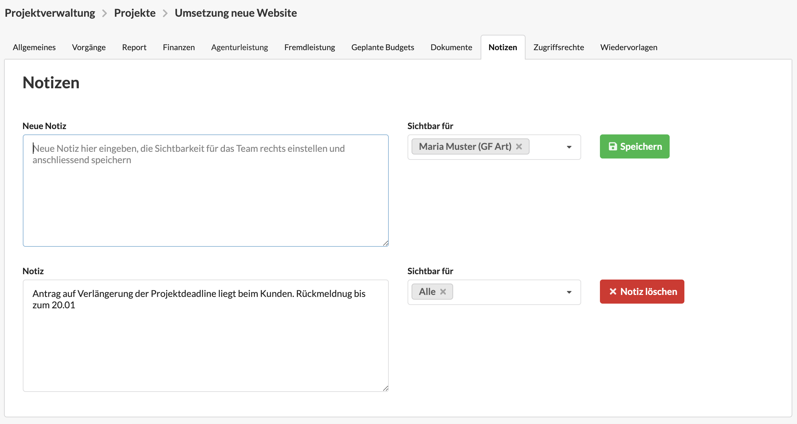

# Notizen in der Projektverwaltung

Auf den drei Hierarchieebenen der Projektverwaltung \(Kunde, Etat und Projekt\) könnt ihr im Reiter "Notizen" für den jeweiligen Datensatz **Notizen anlegen und optional mit eurem Team teilen.**

Zum **Anlegen einer neuen Notiz**, tippt euren Notiztext einfach in das Feld "Neue Notiz" ein, legt die Sichtbarkeit des Eintrags fest und klickt auf den Speichern-Button.

Ihr könnt beliebig viele Notizen mit verschiedenen Sichtbarkeiten anlegen. Im **Feld "Sichtbar für"** könnt ihr entweder einen oder mehrere Benutzer auswählen oder über den Eintrag "Alle" die Notiz für alle Benutzer freigeben.

Notizen können von allen Benutzern, welche die Notiz ansehen können, auch bearbeitet werden. Somit könnt ihr die Notizen im Team immer aktuell halten.


Ihr wollt eine persönliche Notiz anlegen, die nur ihr sehen könnt?

Dann wählt lediglich euren Namen im Feld "Sichtbar für" aus.   
Andere Benutzer der Agenturverwaltung können diese Notiz nun nicht sehen.



Notizen sind nicht auf den verknüpften Hierarchieebenen einsehbar.   
Das heißt, ein Notiz am Projekt ist nicht im verknüpften Etat oder in anderen Projekten des Etats sichtbar.


