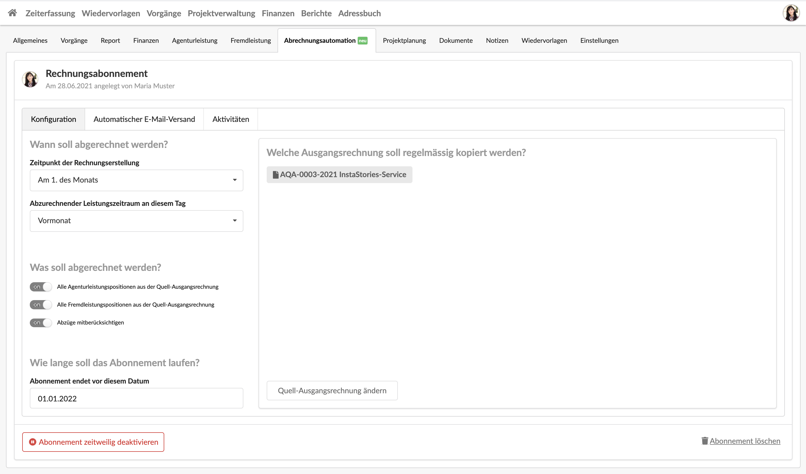
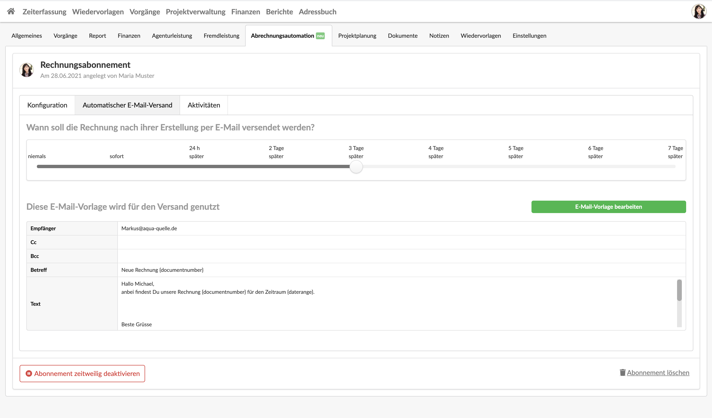
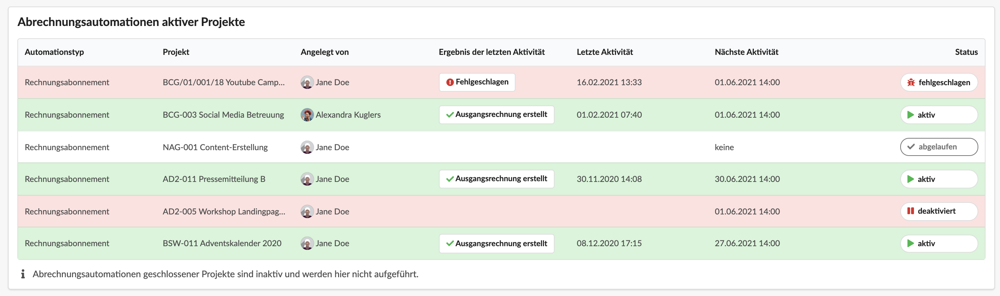

# Abrechnungsautomation

Mit Rechnungsabonnements kannst Du wiederkehrende Leistungen vollautomatisch abrechnen und die Rechnung auf Wunsch sogar automatisiert per E-Mail an deine Kunden zustellen.

In diesem Video wird erklärt wie das geht:



## Rechnungsabonnement konfigurieren

Im Reiter _Abrechnungsautomation_ eines Projekts kann eine Rechnungsautomation erstellt werden.\
Eine Rechnungsautomation sorgt dafür das eine bereits bestehende Quell-Ausgangsrechnung - z.B. die monatliche Abrechnung eines Retainers - künftig automatisch monatlich aus dieser Vorlage erstellt wird.

## Optional: E-Mail-Versand konfigurieren

Ein Abonnement kann auch so konfiguriert werden, dass die automatisch erstellte Rechnung gleich an den Kunden versendet wird.

## Liste aller Abrechnungsautomationen

Im Menüpunkt _Finanzen > Abrechnungsautomationen_ werden alle Rechnungsabonnements Kundenübergreifend aufgeführt.&#x20;

Aus dieser Liste geht auch hervor, wenn es Problem bei der Erstellung oder der Abrechnung gab,  welche Abonnements gerade pausiert oder abgelaufen sind und wann die nächste Aktivität geplant ist.

&#x20;
