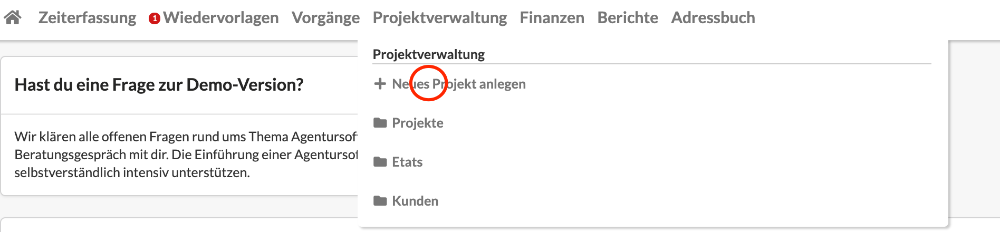
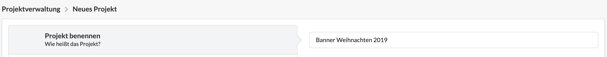
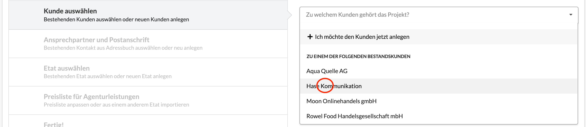
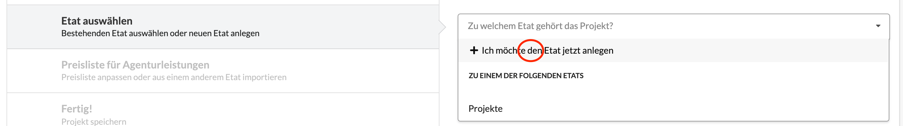
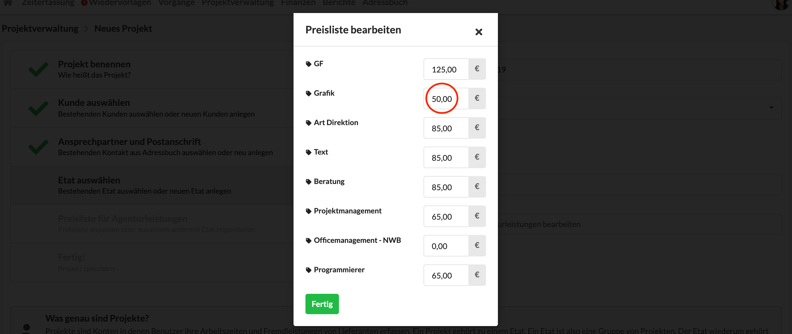

# Neues Projekt anlegen

Auf dieser Seite erfahren wir, wie wir ein neues Projekt mit dem Projekt-Assistenten anlegen. Im Zuge dessen werden wir auch einen neuen Etat mit einer abweichenden Preisliste anlegen.

Ihr könnt euch dieses How-To entweder als Video ansehen oder weiter unten in Textform.



### Schritt-für-Schritt zum neuen Projekt

Ein neues Projekt wird in der Projektverwaltung angelegt. Den Assistenten zur Erstellung eines neuen Projekts erreicht ihr unter Projektverwaltung &gt; Neues Projekt anlegen.

Dieser Assistent führt euch in sechs Schritten zu einem neuen Projekt.

Im ersten Schritt vergeben wir einen Namen für das neue Projekt.

Im zweiten Schritt wird ein vorhandener Kunde ausgewählt oder ein neuer Kunde anlegt. Im Beispiel wählen wir einen vorhandene Kunden aus und überspringen damit den dritten Schritten des Assistenten, weil wir an dieser Stelle keine neuen Kontaktdaten hinterlegen müssen. 

Im vierten Schritt wird ein bestehender Etat ausgewählt oder ein neuer Etat angelegt. Da unser Banner-Projekt zu dem neuen Etat „Weihnachten 2018“ gehört, legen wir auch diesen neuen Etat an.

Im fünften Schritt können wir die Stundensätzen für diesen Etat anpassen, sollten diese von der Agenturpreisliste abweichen. In diesem Fall wurde mit dem Kunden vereinbart, dass Grafik-Leistungen zum Netto-Stundensatz von 50 statt 60 € abgerechnet wird. Diese Information wird in der neuen Etatpreisliste hinterlegt.

Mit den Klick auf „Projekt anlegen“ werden sowohl der neue Etat als auch das neue Projekt angelegt. 

Wir gelangen zur Projekt-Detailseite und sehen hier, dass das Projekt im Etat „Weihnachten 2018“ angelegt wurde.

Nun können wir in diesem Projekt beispielsweise erste Vorgänge anlegen oder einen Kostenvorschlag erstellen.


**Übrigens**: Es macht unter Umständen Sinn nicht für jeden Neugeschäftskostenvoranschlag ein Projekt anzulegen. Stellt eure Agentur sehr vielen Neukunden im Monat Angebote zu, ohne zu Wissen, ob sich daraus tatsächlich ein Auftrag ergibt, ist es einfacher, das Projekt erst nach Freigabe eines Kostenvoranschlags zu erstellen und den freigegebenen Kostenvoranschlag erst dann dem neuen Projekt zuzuordnen. Auf diese Weise wird vermieden, dass wir die Übersicht aufgrund sehr vieler nicht realisierte Projekte verlieren.


