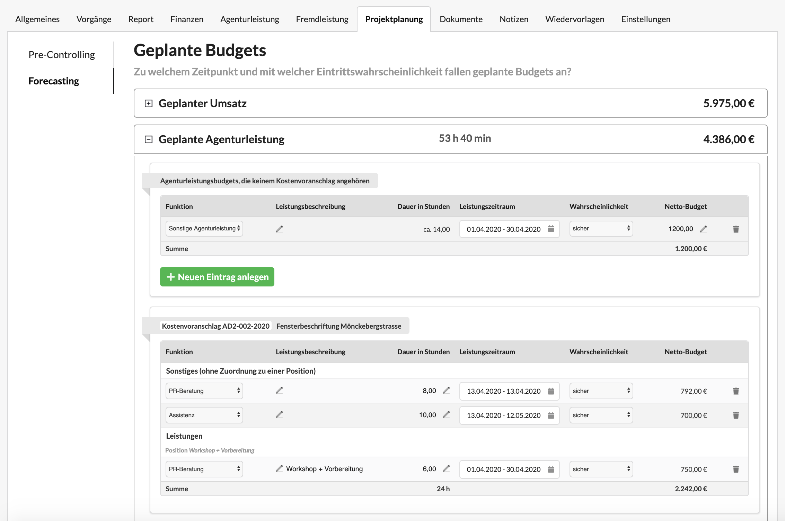

# Forecasting

Diese Ansicht erlaubt uns an Geplanten Budgets einzustellen mit welcher Eintrittswahrscheinlichkeit wir rechnen und in welchen Zeitraum die Leistung fallen wird.

Diese Daten werden unter Berichte &gt; Vorschauberichte genutzt um ein Forecast-Zeitstrahl über die kommenden Monate zu erstellen.

Die Budget, die in einem Kostenvoranschlag erstellt wurden, werden hier gegliedert nach Kostenvoranschlag, Positionsgruppe und Position ausgegeben.

Budgets können 

a\) am Projekt,  
b\) am Kostenvoranschlag  
c\) oder einer Position eines Kostenvoranschlags definiert werden.

