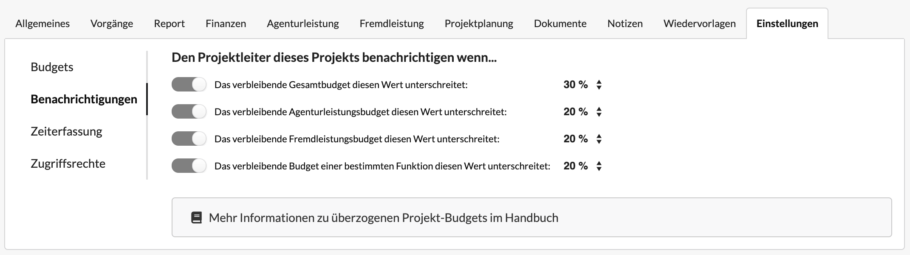
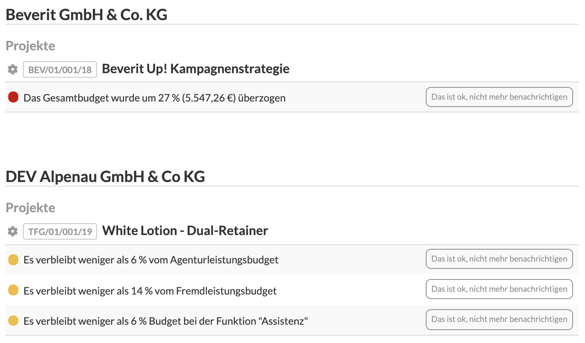

# Projekteinstellungen: Benachrichtigungen

Im Reiter "Einstellungen" eines Projekts kann unter "Benachrichtigungen" konfiguriert werden, unter welchen Umständen der Projektleiter eines Projekts über Budget-Überziehungen in diesem Projekt benachrichtigt werden soll.

Im Reiter "Allgemeintes" gibt es ein Benutzer-Auswahlfeld "Verantwortlicher". Dieses Feld zeigt an, wer zur Zeit dieses Projekt leitet. Dieser Nutzer erhält ggf. Benachrichtigungen.

Mit den Häkchen kann angegeben werden, ob eine Überziehung überhaupt zu einer Benachrichtigung führen soll.


Bei einigen  - z.B. internen - Projekten, ist gar kein Budgetrahmen hinterlegt. Diese Projekte sind dann immer überzogen, eine Benachrichtigung wäre daher nicht nützlich.


Mit dem Prozent-Auswahlfeld kann angegeben werden, ab wann ein Projekt den Projektleiter benachrichtigen soll.

#### Verbleibendes Budget von Funktionen

Beispiel für ein verbleibendes Budget einer Funktionen wäre z.B.  "Grafikdesign". Hier haben wir ein kalkuliertes oder geplantes Budget von 10 h zu 70,- EUR definiert, sind mehr als 8 h angefallen würden wir im oben abgebildeten Beispiel eine Warnung für das Grafikdesign-Budget dieses Projekts erhalten, da nun weniger als 20% Restbudget verbleiben.

## Alle überzogenen Projekte einsehen

Im Hauptmenü unter Berichte &gt; Überzogene Budgets können alle Projektüberziehungen eingesehen werden:

### Filter nach Projektleiter und nach neuesten Ereignissen

Diese Liste kann für Administratoren entweder alle oder die Projekte eines bestimmten Nutzers anzeigen. Für Nicht-Administratoren zeigt sie lediglich die eigenen Projekte an.

Mit dem Filter "Nur Überziehungen der letzten 24 h anzeigen" werden nur Projekte angezeigt bei denen Ereignisse in den letzten 24 h zu einer Überziehung geführt haben.

## Benachrichtigungen per E-Mail

Sofern der Benutzer seine E-Mail-Benachrichtigungen nicht deaktiviert hat, sendet Die Agenturverwaltung der Person die hier eingetragen ist eine E-Mail mit einer Liste der überzogenen Projekte.


**Achtung**: In der Liste dieser E-Mail sind nur Projekte aufgelistet, bei denen eine Überziehung innerhalb der letzten 24 Stunden stattgefunden hat. Projekte die vorher überzogen wurden werden hier nicht erneut aufgeführt.


