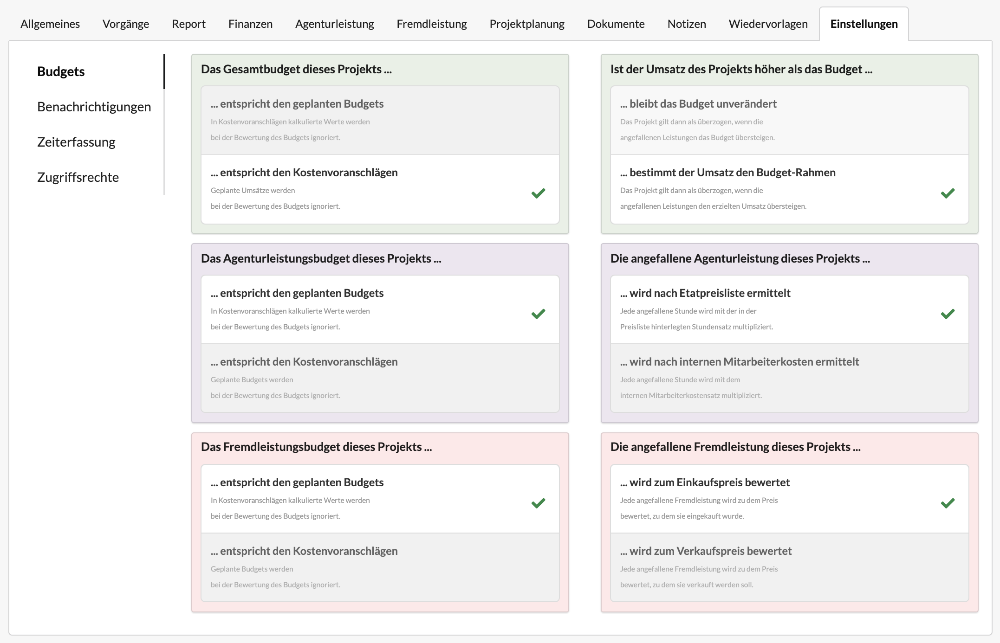

# Projekteinstellungen: Budgets

Um ein Projekt auswerten zu können, ist es wichtig zu wissen welchen Budget-Rahmen es hat und was in diesem Rahmen an Leistungen bereits angefallen ist.

Wir unterscheiden dabei zwischen drei Budgets:

#### Das Gesamtbudget

Es definiert wieviel Umsatz dieses Projekt voraussichtlich machen wird, unabhängig davon ob Teile dieses Umsatzen an externe Dienstleister und Lieferanten abgegeben werden müssen.

Es kann über die Summe aller freigegebenen Kostenvoranschläge definiert werden \(Standardeinstellung\) oder über Geplante Budgets definiert werden. Geplante Umsatz-Budgets können im Projekt im Reiter "Projektplanung" &gt; "Forecast" erzeugt werden - z.B. wenn es gar keinen Kostenvoranschlag gibt.

Es gibt Fälle in denen mehr Umsatz erzielt wurde als im Kostenvoranschlag oder in Geplanten Budgets definiert war. In solchen Fällen kann am Projekt eingestellt werden ob der Gesamtbudget-Rahmen des Projekts sich weiterhin am Planwert oder am erzielten \(höheren\) Umsatz orientieren soll.

#### Das Agenturleistungsbudget

Das Agenturleistungsbudget eines Projekts gibt vor, wieviel Leistung das Team für das Projekt einsetzen darf. 

Dieses Leistungen können entweder durch die Kostenvoranschläge eines Projekts definiert sein \(Standardeinstellung\), oder über Geplante Budgets für Agenturleistungen. Geplante Budgets können entweder an einer Kostenvoranschlagspositione im Reiter "Geplante Budgets" oder im Reiter "Budgetplanung" &gt; "Forecast"  eines Kostenvoranschlags oder im Reiter "Projektplanung" &gt; "Forecast" eines Projekts definiert werden - z.B. wenn es gar keinen Kostenvoranschlag gibt oder die Werte des Kostenvoranschlags nicht realitätsnah sind.

In der rechten Spalte haben wir die Möglichkeit zu konfigurieren ob wir als Kennzahl für angefallene Agenturleistung die Etat-Preisliste eines Projekts zugrunde legen wollen, oder den im Arbeitsverhältnis jedes einzelnen Benutzers definierten _Internen Mitarbeiterkostensatz_. Das Projektergebnis kann je nach Auswahl und Einstellung signifikant anders ausfallen.

Mehr zu Arbeitsverhältnissen und Internem Mitarbeiterkostensatz findet sich hier:



#### Das Fremdleistungsbudget

Auch für den Budgetrahmen von Fremdleistungen kann in der linken Spalte eingestellt werden, ob er sich aus der Summe der in freigegebenen Kostenvoranschlägen definierten Fremdleistungspositionen oder aus Geplanten Fremdleistungsbudgets ergibt.

Beispielsweise kann ich dem Kunden Druckkosten in Höhe von 500 EUR kalkulieren, die Druckerei hat mir ein Angebot über 350 EUR gemacht, also entscheide ich mich hier evtl. das Geplante Budget für Agenturleistungen auf 350 EUR festzusetzen. Erhalte ich später eine Rechnung der Druckerei in Höhe von 380 EUR, wird das Fremdleistungsbudget des Projekts jedoch überschritten.

In der rechten Spalte kann ich einstellen, ob der Wert der angefallenen Fremdleistungen dem jeweiligen Einkaufswert entspricht \(Standardeinstellung\), also in unserem Beispiel 380 EUR oder dem Verkaufswert \(500 EUR\).

