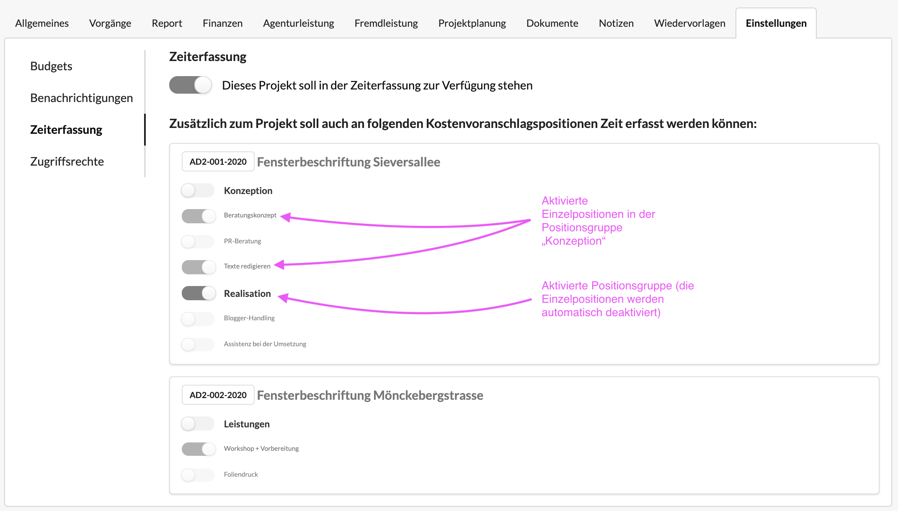
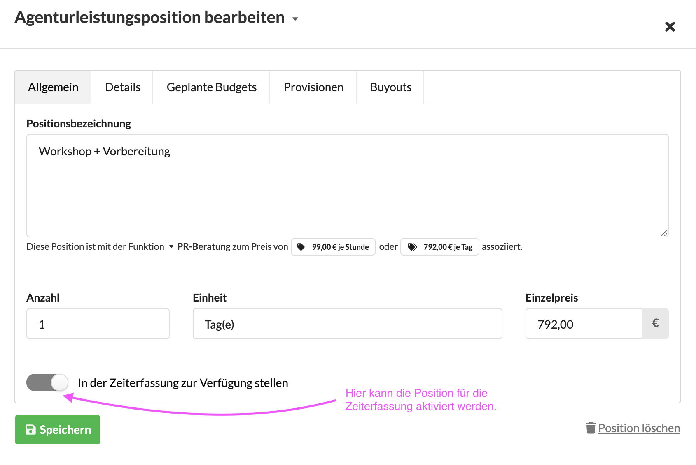
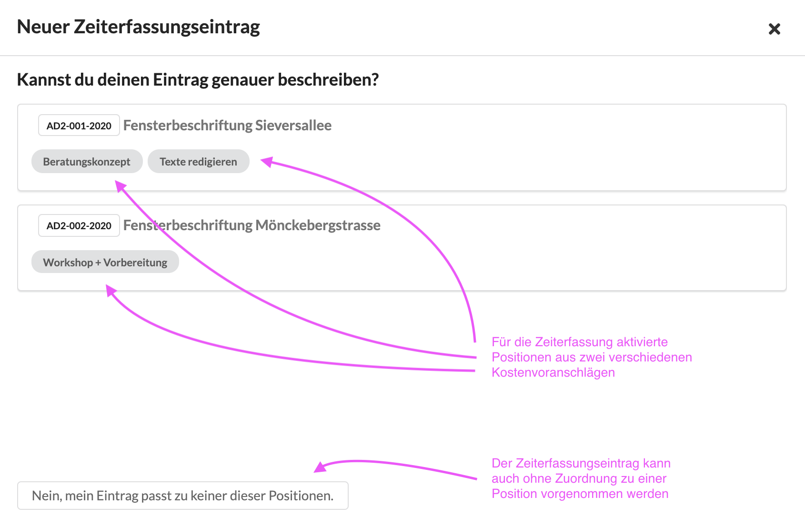

# Projekteinstellungen: Zeiterfassung

Hier kann eingestellt werden, ob ein Projekt generell für die Zeiterfassung freigegeben werden soll.

Standardmässig ist jedes \(aktive\) Projekt in der Zeiterfassung verfügbar.  
Es kann jedoch Sinn machen ein Projekt in der Zeiterfassung zu deaktivieren.


**Anwendungsszenarien**  
Innerhalb eines Kampagnen-Etats wurde ein Projekt für Media angelegt, dass nur für Fremdleistungen eurer Verlagspartner genutzt werden soll, hier soll keine Zeit erfasst werden.  
  
Ihr möchtet ein Projekt pausieren, jedoch nicht auf ruhend oder geschlossen stellen, da noch Fremdleistungen erfasst werden sollen und das Projekt auch weiterhin in allen Statistiken auftauchen soll.


## Zeiterfassung an den Kostenvoranschlagspositionen eines Projekts

Um innerhalb eines Projekts genauer aufschlüsseln zu können, in welchem Zusammenhang Leistungen angefallen sind, kann auch Zeit an bestimmten Kostenvoranschlagspositionen erfasst werden.


**Anwendungsszenario**  
Im Kostenvoranschlags unserers Projekts gibt es zwei Positionsgruppen "Konzeption" und "Realisation" mit verschiedenen Positionen. Wir können unser Team auffordern, die Zeiten innerhalb unseres Projekts auf diesen ausgewählten Positionen zu buchen.


### Kostenvoranschlagspositionen für die Zeiterfassung aktivieren

Es gibt zwei Wege Positionen für die Zeiterfassung zu aktivieren. 

Im Reiter "Einstellungen" unter "Zeiterfassung können wir in einer Übersicht bestimmte Positionen aktivieren oder deaktivieren

Wir können direkt beim Erstellen einer Agenturleistungsposition entscheiden ob diese Position oder Positionsgruppe für die Zeiterfassung aktiviert werden soll.

Wähle ich dann in der Zeiterfassung ein Projekt aus, in dem Positionen für die Zeiterfassung freigeschaltet wurden, werde ich mit folgendem Dialog konfrontiert:

Der Zeit erfassende Nutzer kann an dieser Stelle entscheiden, ob seine Leistung auf eine der vorgeschlagenen Positionen fällt oder \(ganz unten\) ganz allgemein auf das Projekt.

