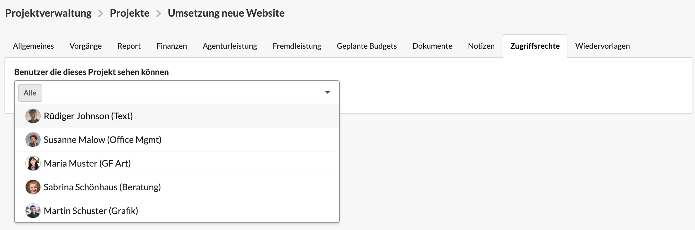

# Projekteinstellungen: Zugriffsrechte

Auf den beiden Hierarchieebenen Projekt und Etat in der Projektverwaltung könnt ihr im Reiter "Zugriffsrechte" die **Berechtigungen für die Sichtbarkeit eines Projekts oder Etats konfigurieren**.

Standardmäßig kann ein neues Projekt oder ein neuer Etat von allen Benutzern der Agenturverwaltung eingesehen werden, welche die allgemeine Berechtigung zur Anzeige von Projekten oder Etats in der Projektverwaltung haben. Mehr zum Thema Berechtigungen findet ihr hier:



Um aber die Berechtigung für ein spezifisches Projekt oder Etats auf spezifisches Benutzer einzuschränken, dient dieser Reiter in der Projektverwaltung.

Über das Dropdown-Element "Benutzer, die dieses Projekt sehen können" kann die Sichtbarkeit auf einzelne Benutzer eingeschränkt werden. Dazu werden nacheinander die Benutzer, welche Zugriffs erhalten sollen, ausgewählt. 

Andere Benutzer der Agenturverwaltung \(mit Ausnahme von Administratoren\) können dieses Projekt dann nicht mehr sehen.


**Anwendungsszenario "Pitch"**  
Ihr arbeitet mit einem kleinen Team an einer geheimen Wettbewerbspräsentation \(Pitch\) und möchtet vermeiden, dass alle anderen Nutzer den Namen dieses Projekts in der Zeiterfassung sehen können.  
  
**Anwendungsszenario "Verkürzung der Projektliste"**  
Ihr könnt durch die Verwaltung von Projektteams die Projektlisten in der Zeiterfassung und anderern Übersichten für die Teammitglieder deutlich verkürzen.


Wir empfehlen von dieser Funktion nur in wirklichen Ausnahmefällen gebrauch zu machen, da sie die Komplexität für alle \(Ich kann mein Projekt nicht finden?\) signifikant erhöht.

