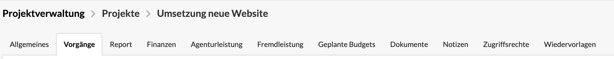
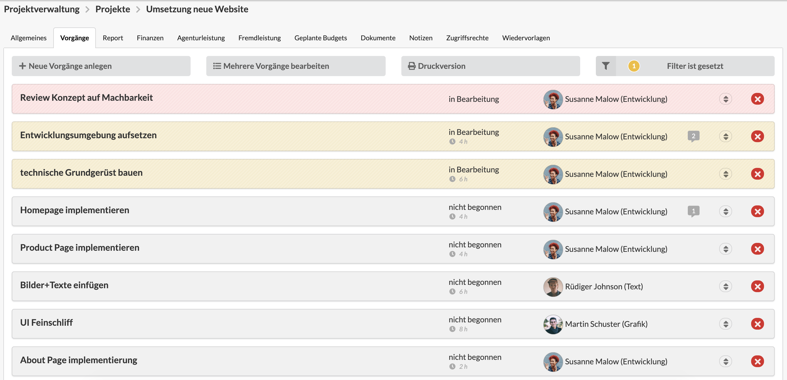
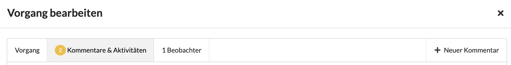
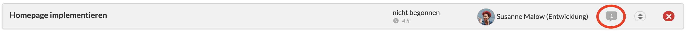

# Vorgänge zur Projektplanung verwenden

Die Verwendung von Vorgängen zur Projektplanung ist ein häufiger Anwendungsfall unter Benutzer der Agenturverwaltung und kann zur Planung und zum Controlling von Projekten verwendet werden.


Du möchtest mehr über Vorgänge im Allgemeinen erfahren? Dann folge [diesem Link.](../../vorgaenge-1/)


Ein gängiges Vorgehen ist es, die Positionen eines Kostenvoranschlags nach dessen Freigabe durch den Kunden in Vorgänge zu überführen. 

Dazu navigieren wir zum entsprechenden Projekt eines Kostenvoranschlags und öffnen in diesem Projekt den Reiter "Vorgänge"

In diesem Reiter können nun Vorgänge über die Schnelleingabe-Maske für Vorgänge, welche über den -Button erreicht werden kann, angelegt werden. Durch das Anlegen der Vorgänge direkt im Projekt werden die Vorgänge automatisch mit diesem assoziiert.

> Abhängig von der Granularität der Kostenvoranschlagspositionen werden die Positionen entweder 1:1 übernommen oder in diesem Schritt in sinnvolle Arbeitspakete für die Umsetzung gestückelt. 
>
> Wie eine sinnvolle Stückelung aussieht, ist vor abhängig von der Art des Projektes, der etablierten Arbeitsweise des Teams und der Frage, ob neben der Agenturverwaltung noch ein weiteres Projektmanagement- oder Issue-Tracking-Tool verwendet wird.

Um Abhängigkeiten zwischen den einzelnen Arbeitspaketen zu berücksichtigen, können die beiden Datumsfelder "Beginnt am" für den frühstmöglichen Starttermin und "Fällig am" für den spätesten Endtermin verwendet werden.

Sind die Vorgänge im Projekt angelegt, kann der Reiter "Vorgänge" fortan zum Controlling der Arbeitspakete verwendet werden.

### Kommunikation in Projekten mit Kommentaren

Während der Durchführung von Projekten findet viel Kommunikation statt. Gibt es eine Frage oder eine Anmerkung im Kontext eines Arbeitspaketes und soll diese nicht in einem Chat- oder Messengerverlauf verloren gehen, bietet sich die Kommentarfunktion an.

Kommentare können über den -Button in der Vorgang-Detailansicht hinzufügt werden. Zum Lesen der Kommentaren navigieren wir zum Reiter "Kommentare und Aktivitäten" in der Vorgang-Detailansicht.

Ob und wie viele Kommentare es zu einem Vorgang gibt, ist bereits auf den Vorgang-Übersichtsseiten an dem Kommentar-Symbol und die Zahl darin erkennbar.


**Auf Kommentare direkt aus dem E-Mail-Programm antworten**  
Alle Beteiligten eines Vorgangs \(Verantwortlicher und die Beobachter\) erhalten Kommentare auch per E-Mail und können auf diese direkt aus ihrem E-Mail-Programm antworten ohne sich bei der Agenturverwaltung anzumelden. Die Antwort wird dann als neuer Kommentar gespeichert und allen anderen Beteiligten erneut per E-Mail zugestellt.


### Vorgänge beobachten, um den Überblick zu behalten

Vor allem als Projektmanager ist es notwendig, den aktuellen Fertigstellungsgrad und die Einhaltung von Meilensteinen im Blick zu behalten, um den Projekterfolg sicher zu stellen. Ein sinnvoller Weg, ist das regelmäßige Beobachten der Projektvorgänge. Dies kann entweder im Reiter "Vorgänge" im Projekt geschehen oder indem ich als Nutzer der Agenturverwaltung alle für mich relevanten Vorgänge beobachte. Wie die Beobachten-Funktion im Detail funktioniert, erfahrt ihr hier:



