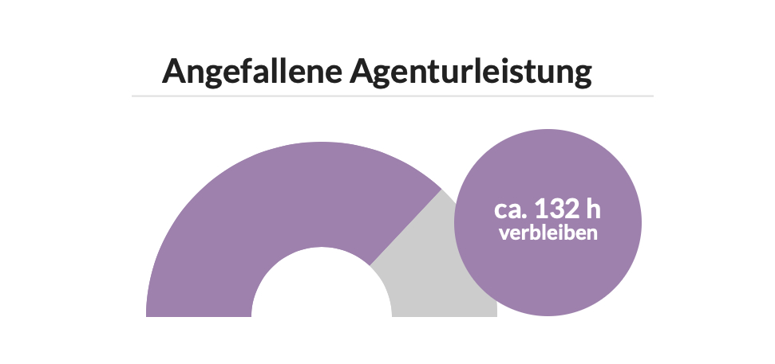
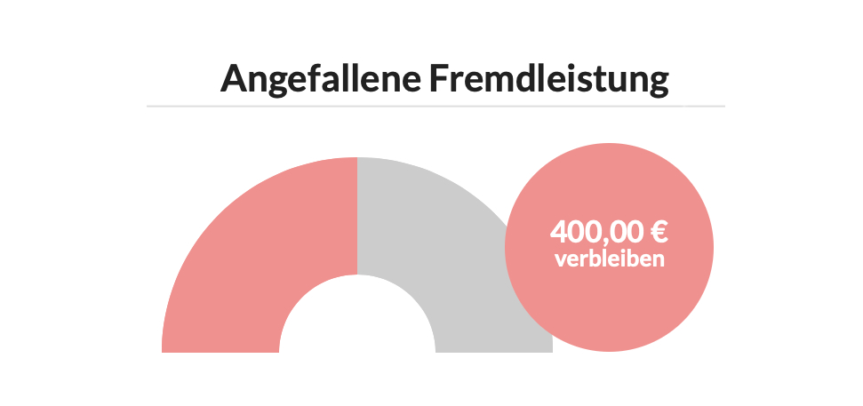

# Reporting in der Projektverwaltung

Sowohl im Kunden, Etat also auch am Projekt finden wir im Reiter "Report" die wichtigsten Kennzahlen.

## Agenturleistung

Dieser Chart zeigt uns, wie viel unseres Agenturleistungsbudget wir bereits verbraucht haben und wieviel Budget - in Form von Arbeitsstunden - uns noch zur Verfügung stehen.

Das verbleibende Stundenkontingent errechnet sich aus den bisher auf dem Projekt angefallenen Stunden. Läuft das Projekt in etwas so weiter, verbleiben uns hier also noch etwa 132 Stunden.

Sind noch gar keine Stunden auf einem Projekt erfasst, errechnet sich dieser Wert aus den durchschnittlichen Stundensätzen der Preisliste in diesem Kontext.

Der Wert richtet sich ggf auch nach dem oben ausgewählten Leistungszeitraum. Wurde in einem KV mit einem Leistungszeitraum von einem Jahr z.B. ein Art-Direktion in Höhe von von 12.000 EUR kalkuliert, wird dieses Budget über den Leistungszeitraum gleichmässig verteilt. Für den März stehen dann für Art-Direktion beispielsweise nur 1.000 EUR zur Verfügung.

## Fremdleistung

Dieser Chart zeigt uns an wieviel Fremdleistungsbudget wir noch haben und wieviel davon bereits verbraucht wurde.

Der Wert richtet sich ggf auch nach dem oben ausgewählten Leistungszeitraum. Ist in einem KV mit einem Leistungszeitraum von 3 Monaten z.B. ein Fremdleistungswert von 3.000 EUR kalkuliert, wird dieses Budget über den Leistungszeitraum gleichmässig verteilt. Es werden für einen dieser drei Monate dann nur ca. 1.000 EUR als Budget angenommen.



