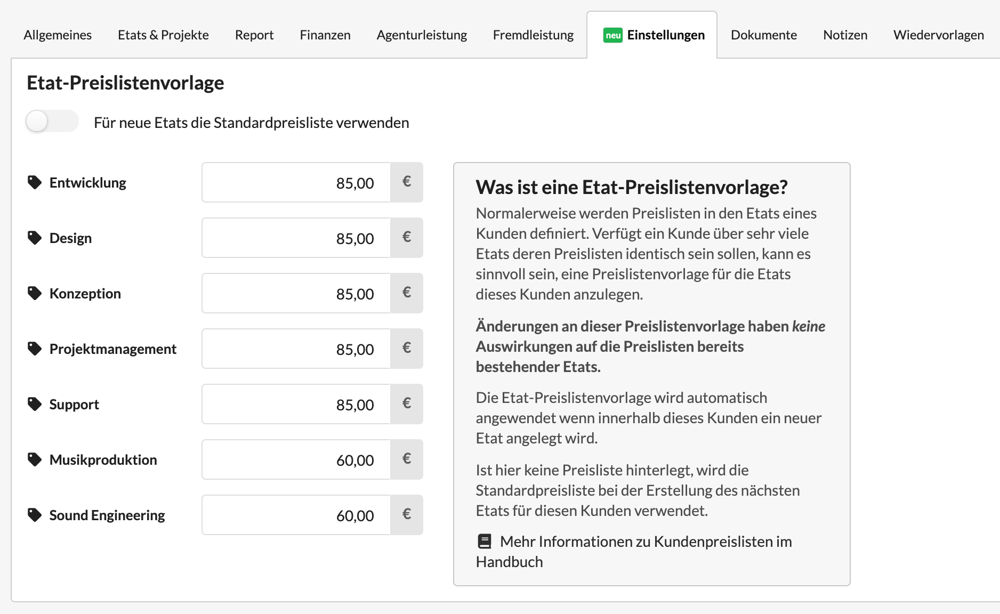

# Einstellungen

## Vorlagen für Etat-Preislisten am Kunden definieren

In bestimmten Fällen mag es vorkommen dass ein Kunde über sehr viele Etats verfügt. Das können z.B. Grosskonzerne mit etlichen Markenkampagnen sein.  
Damit nicht bei jedem neu angzulegenden Etat die Standardpreisliste genutzt und dann für diesen Kunden überarbeitet werden muss erlaub die Agenturverwaltung die Konfiguration einer Etat-Preislistenvorlage am Kunden.

Die Preislistenvorlage kann im Reiter "Einstellungen" eines Kunden erstellt werden.

Ist dort nichts hinterlegt, wird beim Erstellen eines Etats zu diesem Kunden einfach die Standardpreisliste genutzt.

Wird der Schalter "Für neue Etats die Standardpreisliste verwenden" deaktiviert, können wir Preise hinterlegen. Diese werden für jeden neuen Etat der in diesem Kunden ab jetzt erzeugt wird verwendet.

Beim Umstellen wird an dieser Stelle die Standardpreisliste für diesen Kunden vorgeschlagen. Sie kann jetzt verändert werden.


**Hinweis**: Die Anpassung der Preise dieser Preisliste hat _keine_ Auswirkungen auf die Preise bestehender Preislisten. Sie wird erst wirksam, wenn für diesen Kunden ein neuer Etat erzeugt wird.


