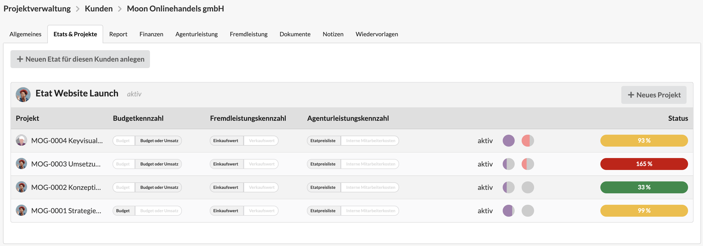

# Etats & Projekte

In dem Reiter "Etats & Projekte" in einem Kunden-Datensatz findet ihr eine Übersicht über alle Etats und Projekte dieses Kunden.&#x20;

Auf dieser Übersicht könnt ihr der letzten Spalte "Status" entnehmen, ob ein Projekt nach aktuellem Stand unter- oder überliefert wurde.&#x20;

Der **farbige Balken** gibt das Verhältnis von gebuchten zu budgetieren Aufwänden (alternativ: Umsatz) an. Die **beiden Kreise** zeigen den bereits gebuchten Anteil an Agenturleistungen (Kreis mit lila Füllung) und Fremdleistungen (Kreis mit rosa Füllung) an. Wenn ihr mit dem Mauszeiger auf einem Kreis bleibt, werden euch die verbleibenden Budgets in Prozent angezeigt.

Über die drei Toggle-Buttons links der Status-Anzeige könnt ihr die Berechnungsgrundlage der Status-Indikatoren verändern:

* Budgetkennzahl: Auswahl, ob zwingend das kalkulierte oder geplante Budget (="Auswahl Budget") oder der eventuell höher ausfallende realisierte Umsatz (=Auswahl "Budget oder Umsatz") als Berechnungsgrundlage verwendet werden soll
* Fremdleistungskennzahl: Auswahl, ob die zu zahlenden Lieferantenkosten (=Auswahl "Einkaufswert") oder der Wert, den ein Kunde für die Leistungen bezahlt (=Auswahl "Verkaufswert") als Berechnungsgrundlage verwendet werden soll
* Agenturleistungskennzahl: Auswahl, ob die Stundensätze der Etatpreisliste (=Auswahl "Etatpreisliste") oder die in den Einstellungen an den Benutzern hinterlegten internen Kosten (=Auswahl "interne Mitarbeiterkosten") als Berechnungsgrundlage verwendet werden soll

Eine Anpassung der Toggle-Buttons wirkt sich sofort auf Indikatoren in der Status-Spalte aus.

Mit einem **Klick auf eine Zeile** gelangt ihr in den detaillierten Report eines Projekts mit **umfangreicheren Auswertungsmöglichkeiten**.&#x20;
