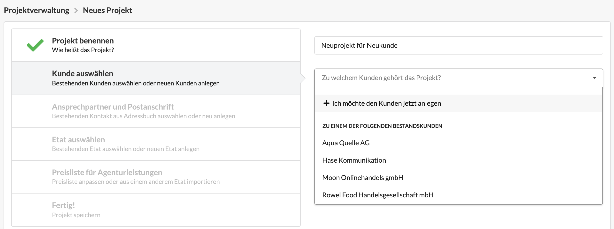

# Neuen Kunden anlegen

Wie in der Einführung beschrieben, ist der Kunde ist höchste Hierarchie-Ebene der Projektverwaltung. Einem Kunden werden Etats, und einem Etat werden Projekte zugeordnet.

Spätestens bei Erstellung eines ersten Projekts für einen Neukunden müssen wir diesen Kunden im System anlegen  Alternativ kann ein Kunde auch unter _Projektverwaltung &gt; Kunden_ erstellt werden.

### Was gehört zu einem Kunden?

Ein Kunde benötigt bei der Erstellung zunächst nur einen Namen. Üblicherweise wird der Name der Organisation oder Firma verwendet.   
Aus dem Kundennamen wird vom System ein eindeutiges Kundenkürzel erstellt. Diese Kürzel lässt sich bei beim Anlegen eines Kunden anpassen, wenn gewünscht.

Im nächsten Schritt des Wizards muss eine Kontaktperson und damit die Adresse des Kunden hinterlegt werden. Dabei kann ein bereits vorhandener Kontakt verknüpft oder ein neuer angelegt werden.

