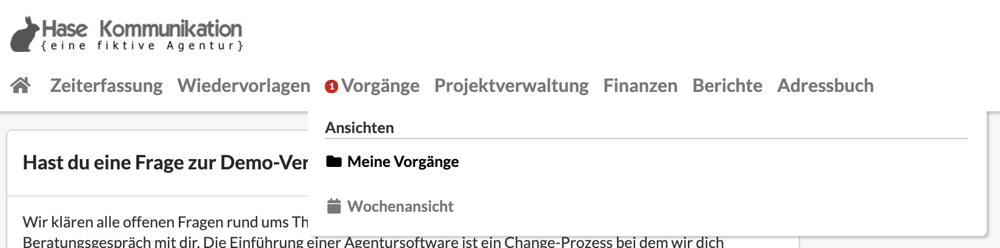
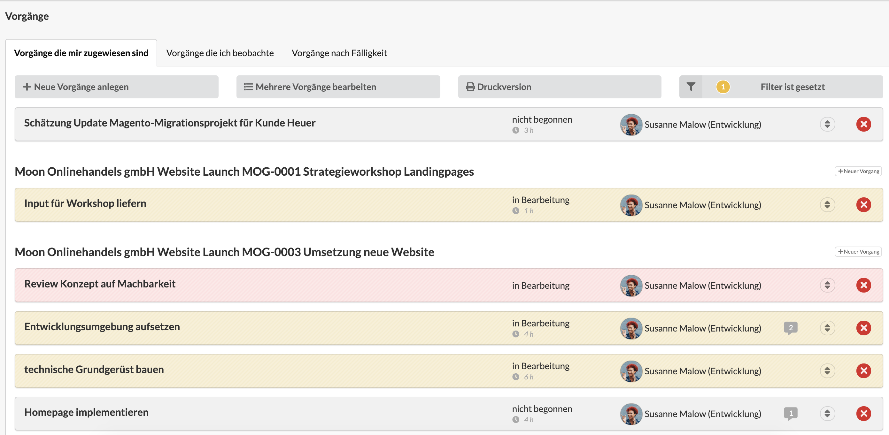
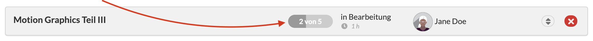
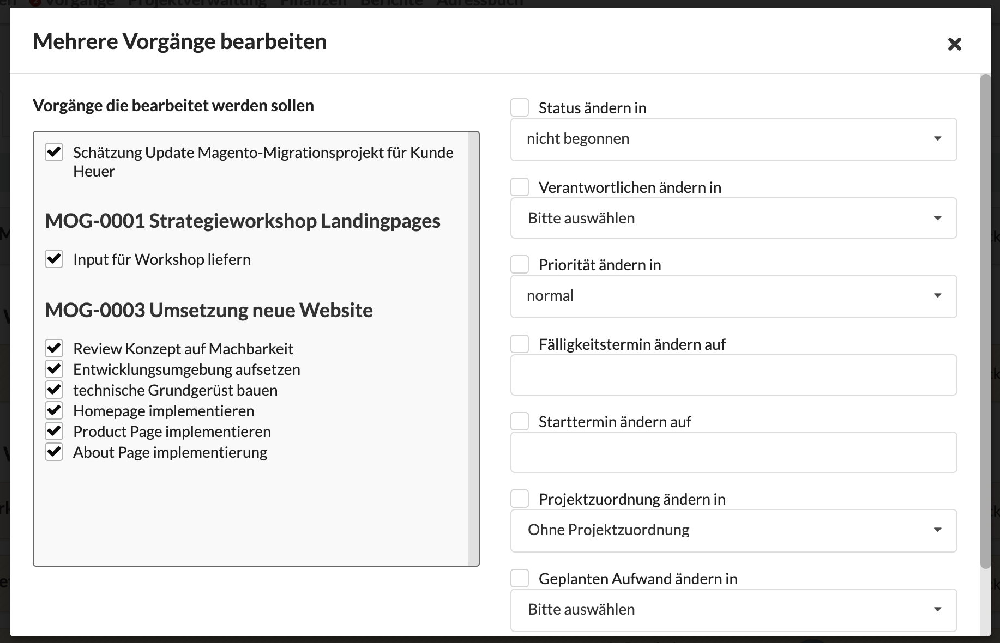
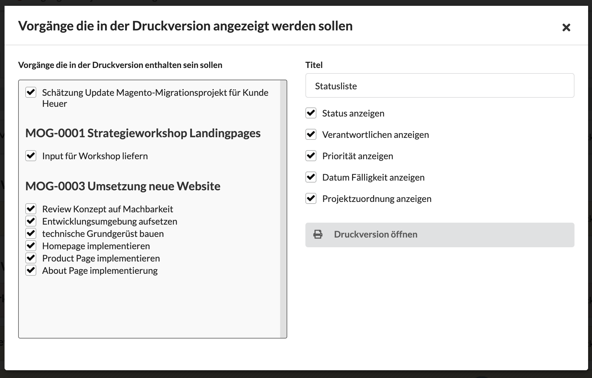
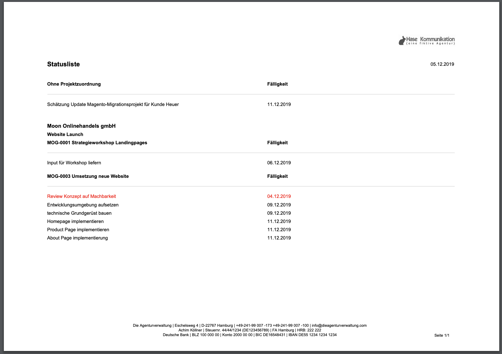
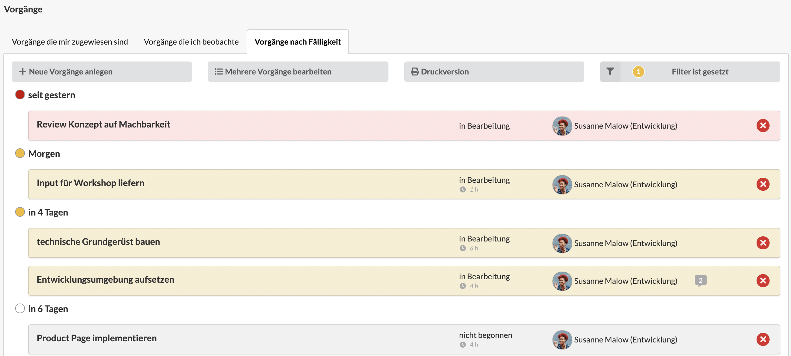
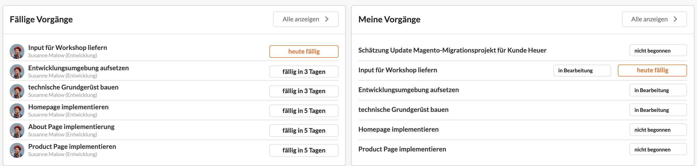

# Meine Vorgänge

Eine Übersicht über alle, mir zugewiesenen Vorgänge erhalte ich in auf der Seite "Meine Vorgänge", welche ich über die Navigation erreichen kann.

Die Übersichtsseite ist nach Projekten gegliedert und kann innerhalb der Projekte mit Hilfe des -Buttons sortiert werden. Farblich hervorgehoben werden Vorgänge, die in wenigen Tagen fällig sind (orangener Hintergrund) und deren Frist bereits abgelaufen ist (roter Hintergrund).

Über den Filter-Button  oberhalb der Übersicht können Filter auf die Ansicht konfiguriert werden, um bspw. nur Vorgänge mit hoher Priorität anzuzeigen.

Unterhalb der Vorgangsliste wird der _Geschätzte Gesamtaufwand,_ also die Summe aller an den Vorgängen hinterlegten Aufwänden, angezeigt.\
.png>)&#x20;


**Vorgänge eignen sich nicht für private oder vertrauliche Notizen!**\
Selbst wenn ein Vorgang nur für den Autor angelegt ist, er ist im Projekt und - sofern er über ein Startdatum verfügt - auch in der Wochenansicht der Vorgänge samt aller Kommentare für diejenigen Nutzer sichtbar, die Zugriff auf die Wochenansicht der Vorgänge des Teams oder die Vorgänge des entsprechenden Projekts haben.


### Erstellen von Vorgängen

Mit einem Klick auf den Button "+ neuen Vorgang anlegen" kann ein Vorgang angelegt werden.

Die Auswahlfeld direkt rechts am Schalter erlaubt auch das Erstellen mehrerer Vorgänge über den Schnelleingabe-Wizard:

In dem großen Freitextfeld können gleich mehrere Vorgänge zeilenweise angelegt werden. Dabei kann durch Angabe eines Datums direkt die Fälligkeit gesetzt und durch Angabe eines Benutzernamens (René Mustermann und Maria Muster im Beispiel) eine Zuordnung der Verantwortlichkeit vorgenommen werden.

Die Werte der anderen Felder (Status, Priorität, Beginnt am, Projekt) werden an allen Vorgängen hinterlegt.&#x20;

Mit Klick auf den Speichern-Button werden die Vorgänge angelegt.

###

### Vorgänge aus Positionen eines Kostenvoranschlags erzeugen

Im Auswahlfeld "Neuer Vorgang" gibt es auch die Optione "Vorgänge aus KV-Positionen erstellen". Hier kann ein Kostenvoranschlag gesucht und ausgewählt werden. Iim nächsten Schritt werden dann Positionen dieses KVs ausgewählt und mit einem Klick in Vorgänge umgewandelt.&#x20;

Befindet sich der Nutzer in der Liste der Vorgänge eines Projekts, werden diese Vorgänge in diesem Projekt angelegt. Ansonsten im Projekt, des ausgewählten Kostenvoranschlags. Liegt auch hier kein Projekt vor, so werden die Vorgänge ohne Projekt erzeugt.

[https://youtu.be/cxFMR1vE-wA](https://youtu.be/cxFMR1vE-wA)

### Zeit an Vorgängen erfassen

Innerhalb eines Projekts kann Zeit auch an Vorgängen erfasst werden. Dazu legt man einen Vorgang an und aktiviert den Schalter "Vorgang für die Zeiterfassung zur Verfügung stellen".

Im Zeiterfassungsdialog, wird dann nach der Auswahl des Projekts abgefragt, zu welchem Vorgang der Zeiterfassungseintrag gehört:



An Vorgängen erfasste Zeiten können im Reiter "Agenturleistungen" eines Kunden, Etats oder Projekts ausgewertet werden.

### Bearbeiten von Vorgängen

Zur Bearbeitung eines Vorgangs wird dieser einfach angeklickt. In der Bearbeitungsmaske können alle Felder angepasst oder aktualisiert werden.

**Dokumente hochladen**

Im Tab "Dokumente" können Datei-Anhänge zu diesem Vorgang per Drag & Drop hinzugefügt werden.

### Checkliste um den Fortschritt eines Vorgangs zu erkennen

Vorgänge verfügen über ein Beschreibungsfeld. Diese kann zum Einen genutzt werden, um nützliche Informationen, z.B. ein Briefing, weiterführende Links oder eine Checkliste, ähnlich einer Todo-Liste zu hinterlegen.


Eine Checkliste entsteht automatisch wenn in der Beschreibung des Vorgangs folgende Syntax verwendet wird:

`Folgendes bitte umsetzen`\
`[x] Briefing erstellen`\
`[x] Motivauswahl`\
`[ ] TouchUp Motive`\
`[ ] Interne Abstimmung`\
`[ ] Motiv-Versand`


Die Agenturverwaltung erkennt an den eckigen Klammern im Fliesstext automatisch, dass es sich um ein Checklistenelement handelt.

Der Status der Checkliste dieses Vorgangs wird in der Vorgangsübersicht dann mit einem Fortschrittsbalken angezeigt aus dem zu erkennen ist wieviele Aufgaben des Vorgangs bereits erledigt wurden:

### Dokumentenanhänge in Vorgängen

Zu Vorgänge können auch Dokumente per Drag & Drop hochgeladen werden, das können beispielsweise Briefing-Informationen oder Materialen für die Umsetzung sein.

### Stapelverarbeitung: Gleichzeitig mehrere Vorgänge bearbeiten

Eine Mehrfachbearbeitung ist über den Button "Mehrere Vorgänge bearbeiten"möglich. Im sich öffnenden Stapelverarbeitungsdialog können links die zu bearbeitenden Vorgänge ausgewählt. Auf der rechten Seite werden dann die anzupassenden Felder durch die Check-Box zur Bearbeitung markiert und anschließend mit einem neuen Wert belegt.

### Erstellung von Statuslisten mit der Druckfunktion

Mit Hilfe der Druck-Funktion  kann mit wenigen Klicks auf eine Statusliste im Briefpapier-Design der Agentur erstellt werden. Die anzuzeigenden Daten sind dabei im Druck-Wizard konfigurierbar.

Eine Statusliste in der Druckvorschau sieht zum Beispiel wie folgt aus. Über die Konfiguration des Briefpapiers kann die Druckversion individuell gestaltet werden. Mehr zum Thema Briefpapier erfährst du [hier](../erste-schritte-1/grundeinstellungen/briefpapier-anpassen.md).

### Tipp: Ansicht der Vorgänge nach Fälligkeit

Neben der Standardansicht, welche in Projekten gruppiert und individuell sortiert ist, kann über den Reiter "Vorgänge nach Fälligkeit" zu einer alternativen Ansicht navigiert werden.

Hier werden deine eigenen Vorgänge und die Vorgänge anderer Nutzer die du beobachtest, nach Fälligkeit sortiert angezeigt. Dies ist hilfreich, um die Deadlines verschiedener Vorgänge projektübergreifend im Blick zu behalten.

### Tipp: Relevante Vorgänge auf dem Dashboard

Einen guten Überblick über aktuell relevante Vorgänge erhält man auch auf dem persönlichen Dashboard. In zwei Widget werden zum einen alle für mich freigegebenen, **fälligen Vorgänge,** sortiert nach ihrer Fälligkeit, angezeigt. Dies hilft jene Vorgänge zu identifizieren, welche aktuell deine Aufmerksamkeit benötigen. In dem zweiten Widget "**Meine Vorgänge**" werden alle mir zugewiesenen Vorgänge, gemäß ihrer Sortierung im Reiter "Meine Vorgänge" angezeigt. Über den "Alles anzeigen >"-Button jeweils oben rechts im Widget gelangt man zur Übersichtsseite.


**Vorgänge für Standardprozesse bei wiederkehrenden Projekten**\
Die Agenturverwaltung erlaubt auch die Konfiguration von Standardprojekten, die z.B. einem wiederkehrenden Ablauf folgen und bei deren Initialisierung gleich eine Reihe von Vorgängen erstellt werden sollen.&#x20;

Sollte das bei eurem Unternehmen der Fall sein, sprecht uns an: \
info@dieagenturverwaltung.de

