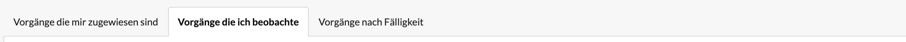
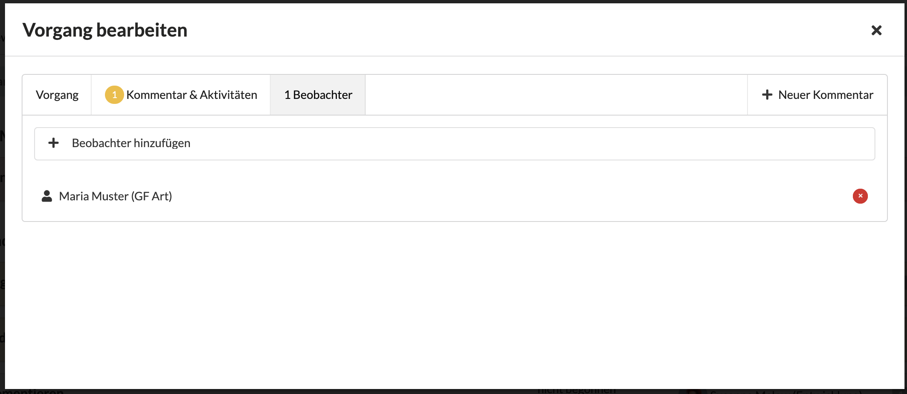

# Vorgänge die ich beobachte

Eine Übersicht über alle, von mir beobachteten Vorgänge erhalte ich in der Registerkarte "Vorgänge, die ich beobachte" auf der Seite "Vorgänge",  welche ich über die Navigation erreiche.

> Die Beobachtungsfunktion ist vor allem für Projektleiter und Führungskräfte konzipiert, um einen Überblick über alle Vorgänge eines Projektes oder eines Teams zu erhalten.

Neben der Auflistung der von mir beobachteten Vorgänge in der entsprechenden Registerkarte erhalte ich auch Benachrichtigungen, z.B. wenn sich der Status eines Vorgangs ändert, beispielsweise weil er geschlossen wurde, oder wenn ein Kommentar hinzugefügt wird.

### Wie beobachte ich einen Vorgang?

#### Vorgang einem anderen Nutzer zuweisen

Hat man einen Vorgang erstellt und weist diesen zur weiteren Bearbeitung einem anderen Nutzer zu, wird der Autor des Vorgangs automatisch zum Beobachter. So behält der Autor die Aufgaben delegiert wurden weiterhin im Blick.

#### Sich als Beobachter eintragen

Um einen Vorgang zu beobachten öffnet man den Vorgang zur Bearbeitung durch einen Klick auf den Vorgang. In der Registerkarte "Beobachter" werden alle Benutzer, welchen diesen Vorgang bereits beobachten, aufgelistet.

Mit Hilfe des Auswahl-Elements "+ Benutzer hinzufügen" kann ich mich selbst oder einen anderen Benutzer zur Beobachtung dieses Vorgangs hinzufügen.

#### Als Beobachter keine weiteren Benachrichtigungen erhalten

Möchte man einen Vorgang nicht weiter beobachten, um keine weiteren Benachrichtigungen zu Kommentaren und Änderungen diesen Vorgangs zu erhalten, kann man sich als Beobachter auch löschen, indem man sich im Reiter "Beobachter" des jeweiligen Vorgangs aus der Liste der Beobachter entfernt.

