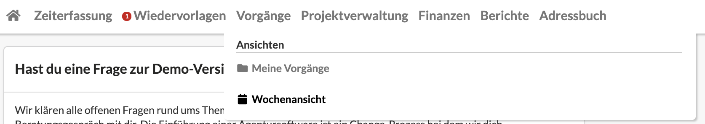
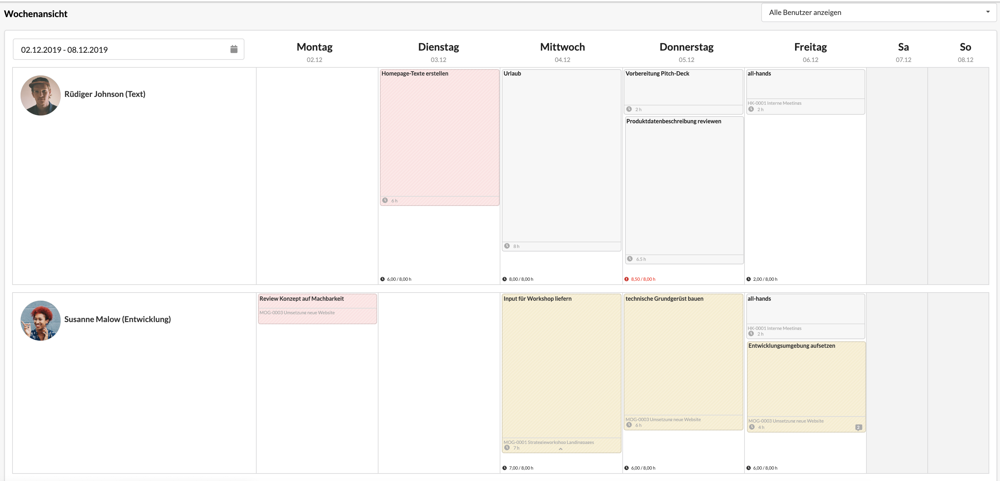
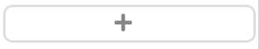
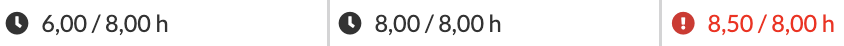

# Wochenansicht der Vorgänge

Die Wochenansicht dient der **Kapazitätsplanung** für ein Team oder die gesamte Agentur. Sie erlaubt einen schnellen Überblick über die Auslastung der Mitarbeiter und ermöglicht es, Vorgänge schnell und unkompliziert zu verschieben, sollten freie Zeiten oder Überlastungen erkennbar werden.  
Auch das Anlegen neuer Vorgänge für einen spezifischen Benutzer an einem ausgewählten Tag ist mit wenigen Schritten möglich.

Zur Wochenansicht gelangt man über die Navigation durch Klick auf "Wochenansicht" im Hauptmenüpunkt "Vorgänge".

Die Wochenansicht zeigt - ihrem Namen nach - nur die Vorgänge _einer_ Woche an, wobei der gewünschte Zeitraum über den Wochenfilter oben links ausgewählt werden kann.

Jeder Zeile repräsentiert einen Mitarbeiter/Benutzer. Auch diese Auswahl kann über einen Filter oben rechts \("Alle Benutzer anzeigen"\) eingeschränkt werden.

Die Spalten zeigen die einzelnen Wochentage an.

Zum Anlegen eines neuen Vorgangs kann der -Button innerhalb einer Zelle verwendet werden. Dieser Button wird angezeigt, sobald sich der Mauszeiger in einer Zelle befindet.

Zum Verschieben von Vorgängen wird ein Vorgang angeklickt und mit der Maus bei gedrückter Maustaste in eine andere Zeile bewegt \(drag & drop\).  
Ein Vorgang kann dabei sowohl in einen anderen Tag als auch zu einem anderen Nutzer verschoben werden.

Am Fuß einer jeden Zelle wird die verplante und die verfügbare Arbeitszeit eines Mitarbeiters/Benutzers an diesem Tag gegenüber gestellt, sofern dieser Mitarbeiter festangestellt ist und eine Tagesarbeitszeit für ihn hinterlegt ist. Ein Ausrufezeichen und eine rote Einfärbung zeigen an, dass die geplante die verfügbare Zeit übersteigt.

### Ihr vermisst Vorgänge in der Wochenansicht?

In dieser Ansicht werden nur Vorgänge angezeigt, die über ein **Startdatum** \(Vorgang beginnt am...\) verfügen und **nicht geschlossen** sind.

