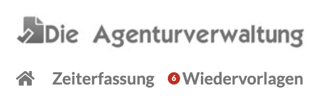
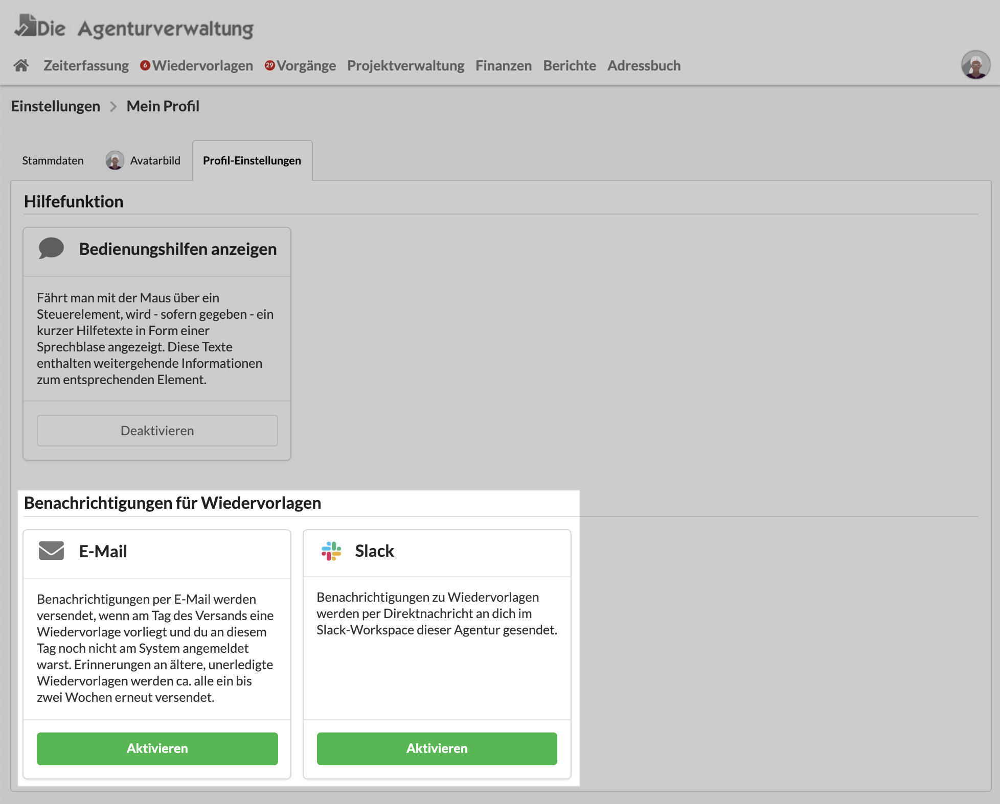

# Benachrichtigungen

### Anzeige von fälligen Wiedervorlagen in der Navigation

### Benachrichtigung per E-Mail

War ein Nutzer über längere Zeit nicht am System angemeldet, erhält er eine E-Mail mit  einem Hinweis auf offene Wiedervorlagen.

### Benachrichtigung auf Slack

Nutzer von Agenturen die den Messaging-Dienst "Slack" nutzen erhalten ihre Benachrichtigungen zu Wiedervorlagen dort als Direkt-Nachricht vom Agenturverwaltungs-Slack-Bot.

### Benachrichtigungseinstellungen ändern

Unter "Einstellungen &gt; Mein Profil" kann jeder Nutzer für sich entscheiden, wie er benachrichtigt werden möchte.

