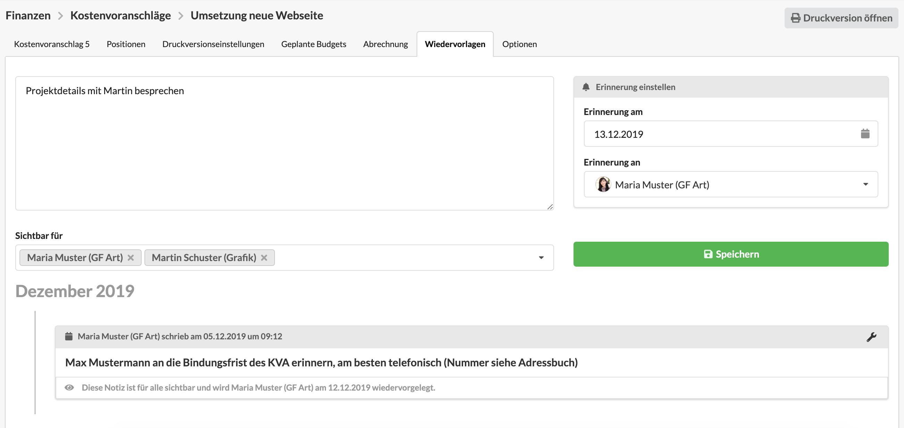
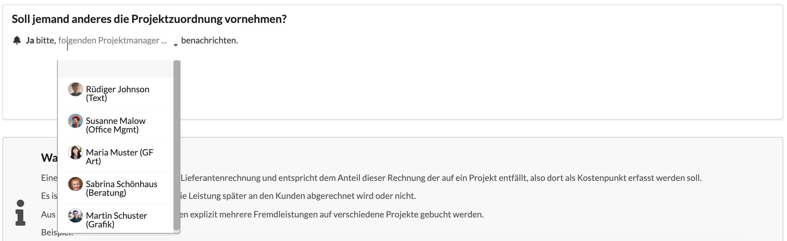
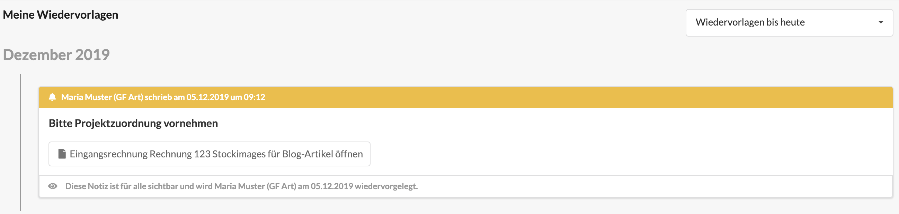

# So werden Wiedervorlagen angelegt

Die Möglichkeit, eine Erinnerung an einem bestimmten Dokumente, Projekt oder Kunden zu hinterlegen, ist in unterschiedlichen Situationen im Agenturalltag hilfreich.

Das Anlegen von Wiedervorlagen ist in folgenden Modulen möglich:

* Kostenvoranschlag
* Ausgangsrechnung
* Gutschriften
* Kontakt
* Projekt
* Etat
* Kunde

Zum Erzeugen einer Wiedervorlage öffnet ihr den Reiter "Wiedervorlage" im jeweiligen Dokument, hier z.B. in einem Kostenvoranschlag.

Nun könnt ihr über den Button "Neue Gesprächsnotiz oder Wiedervorlage anlegen" eine neue Wiedervorlagen erstellen.  

In dem sich öffnenden Dialog habt ihr folgende Möglichkeiten:

* **Notiztext eingeben:** Ein beschreibender Text zur Wiedervorlage, es ist auch möglich lediglich eine Notiz zur Dokumentation eines Vorgangs zu hinterlassen ohne diese dann an einen Nutzer wiedervorzulegen.
* **Sichtbar für:** Auf Wunsch könnt ihr die Sichtbarkeit einer Wiedervorlage auf eine oder mehrere Personen einschränken. Dies kann sinnvoll sein, wenn ihr eine private Wiedervorlage für euch anlegen möchtet oder sensible Projektinformationen nur mit einem kleine Kollegenkreis teilen möchtet.
* **Erinnerung am:** Auswahl der Datumsfrist. Dieses Datum ist relevant für die konfigurierten Benachrichtigungen und die Anzeige der Wiedervorlage in der Agenturverwaltung. Nach diesem Datum wird die Wiedervorlage als überfällig markiert.
* **Erinnerung an:** Eine Erinnerung könnt ihr euch selbst oder einem anderen Benutzer zuweisen, sodass dieser erinnert wird. 

### Wiedervorlagen in Eingangsrechnungen

Beim Erfassen von **Eingangsrechnungen** werden ebenfalls Wiedervorlagen genutzt indem ein Nutzer, der die Eingangsrechnung erfasst, anschliessend per Wiedervorlage einen Projektleiter benachrichtigen kann, damit dieser die Eingangsrechnung seinem Projekt \(als Fremdleistung\) zuordnen kann. Das ist z.B. in Agenturen sinnvoll, bei denen die Buchhaltung zwar Eingangsrechnungen erfasst, aber kein Domänenwissen über die einzelnen Kunden und ihre Projekte hat und die Zuordnung daher den jeweiligen Projektleitern überlässt.

Eine solche Wiedervorlage wird im Reiter "Projektzuordnung" einer Eingangsrechnung angelegt.

Über das Auswahlfeld "Soll jemand anderes die Projektzuordnung vornehmen?" kann eine Wiedervorlage erstellt und direkt dem im Dropdown-Element ausgewählten Benutzer zugewiesen werden.

Der ausgewählte Benutzer sieht dann in der Wiedervorlagen-Übersicht einen Eintrag mit dem Titel "Bitte Projektzuordnung vornehmen" und kann über eine Verlinkung im Eintrag direkt zur Projektzuordnung navigieren.

