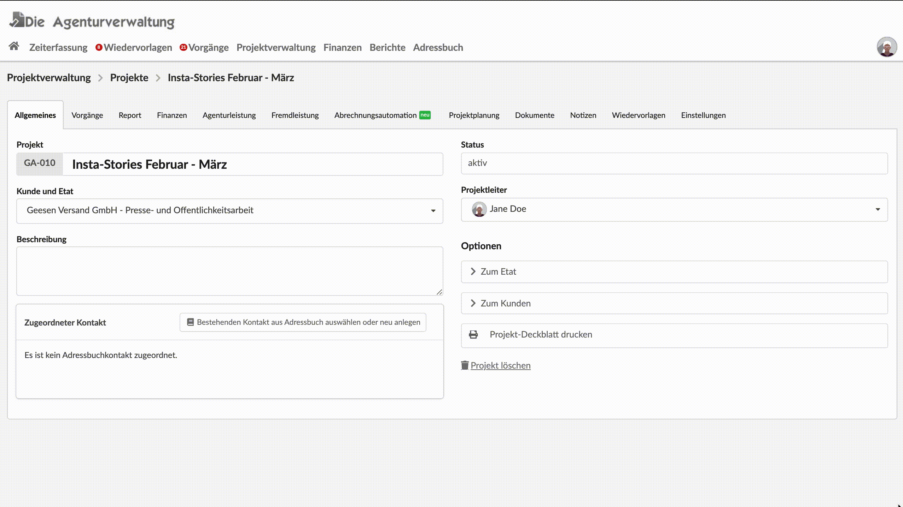

# Wiedervorlagen beim Statuswechsel erstellen

Wir der Status eines Kunden, Etats, Projekts oder Finanzdokuments - z.B. eines Kostenvoranschlags oder einer Rechnung - geändert, können wir direkt anderen Kollegen Bescheid geben, hier zu übernehmen.

Das macht beispielsweise Sinn, wenn ich ein Projekt auf "abzurechnen" umstelle, und einer person aus der Buchhaltung gleich Bescheid geben möchte, dass hier eine Rechnung gestellt werden kann.

Die benachrichtige Person wird dann über eine Wiedervorlage in Kenntnis gesetzt und kann von dort direkt z.B. in das betreffende Projekt oder Finanzdokument springen.

