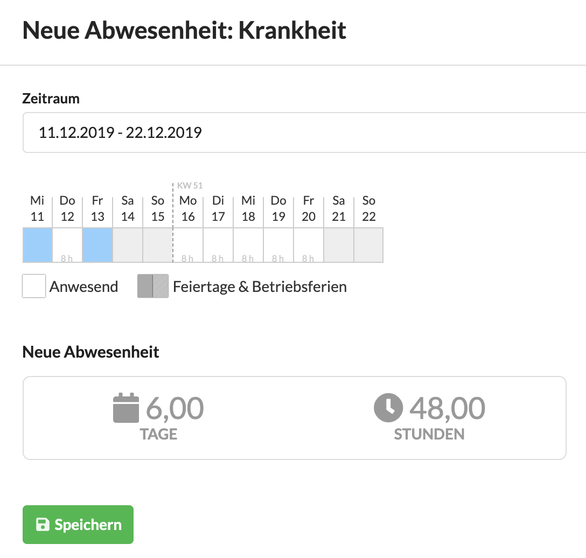
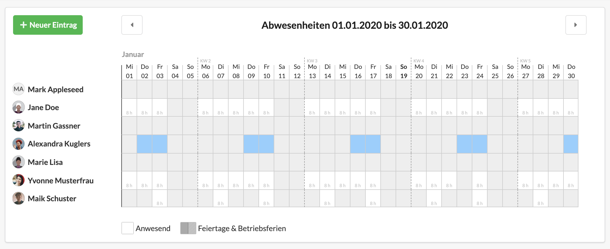

# Abwesenheiten

Die Abwesenheiten des Teams lassen sich in einer kalendarischen Ansicht überblicken.

## Neue Abwesenheit eines Teammitglieds eintragen

Über den Button "Neuer Eintrag" können entsprechend berechtigte Nutzer für andere Mitarbeiter  \(oder Mitarbeiter nur für sich\) eine Abwesenheit in diesen Kalender eintragen.

Dabei wird im ersten Schritt der Abwesenheitstyp \(Urlaub oder Krankheit\) und im zweiten Schritt der Zeitraum der Abwesenheit angegeben. Der Zeitraum kann Wochenenden, freie Tage des Mitarbeiters, Feiertage und sogar Abwesenheiten wie Krankheit überspannen. Das System ermittelt die verbleibenden Arbeitstage und errechnet den benötigten Zeitraum für die neue Abwesenheit.


**Warum wird die Abwesenheit in Stunden errechnet?**  
Wie lange ein Arbeitstag ist, hängt vom Arbeitsverhältnis des Mitarbeiters ab. Arbeitet ein Mitarbeiter z.B. 36 Stunden in der Woche \(weil der Freitags nur halbtags da ist\), würde eine Woche von 5 Tagen Urlaub nur 36 Stunden entsprechen.  
Würde der Mitarbeiter an einem Freitag Urlaub nehmen, entspräche der Urlaubstag hier nur 4 Stunden.


## Abwesenheiten bearbeiten

Eine Abwesenheit kann durch Klick auf einen der Abwesenheitstag bearbeitet werden. Es öffnet sich dann ein Dialog, in dem der Abwesenheitstyp und Anzahl der Stunden der Abwesenheit für den entsprechenden Tag bearbeitet werden können.


**Halbe Urlaubstage eintragen**  
Hat ein MItarbeiter an einem Mittwoch Urlaub und er arbeitet mittwochs gewöhnlich 8 Stunden, kann hier im Dialog 4 Stunden eingetragen werden, wenn es sich nur um einen halben Urlaubstag handelt.


Es ist hier auch möglich die Abwesenheit des entsprechenden Tages zu löschen oder auch den gesamten Zeitraum - also z.B. alle Einträge eines Urlaubs - der Abwesenheit zu löschen.

## Berechtigungen für den Abwesenheitskalender

Damit MItarbeiter   
a\) den Kalender des Teams einsehen und   
b\) wie bisher Urlaub und Krankheit für sich selbst eintragen können  
müssen die entsprechenden Berechtigungen in den jeweiligen Benutzergruppen vergeben. 


**Wichtiger Hinweis zum Datenschutz**  
Wir empfehlen, nicht das ganze Team dazu zu berechtigen auch den Abwesenheitstyp \(also z.B. "Krankheit"\) anderer Nutzer einsehen zu können. Abwesenheiten werden dann einfach grau im Kalender angezeigt, unabhängig davon, ob es sich um Urlaub oder z.B. Abwesenheit durch Krankheit handelt.


In obigen Beispiel ist Alexandra Kuglers nicht berechtigt die Abwesenheitstypen anderer Mitarbeiter einzusehen, daher sind diese nur als ausgegraut erkennbar - es ist für Alexandra nicht ersichtlich, welcher Mitarbeiter krank oder im Urlaub ist, nur ob er an einem bestimmten Tag da ist oder nicht.

