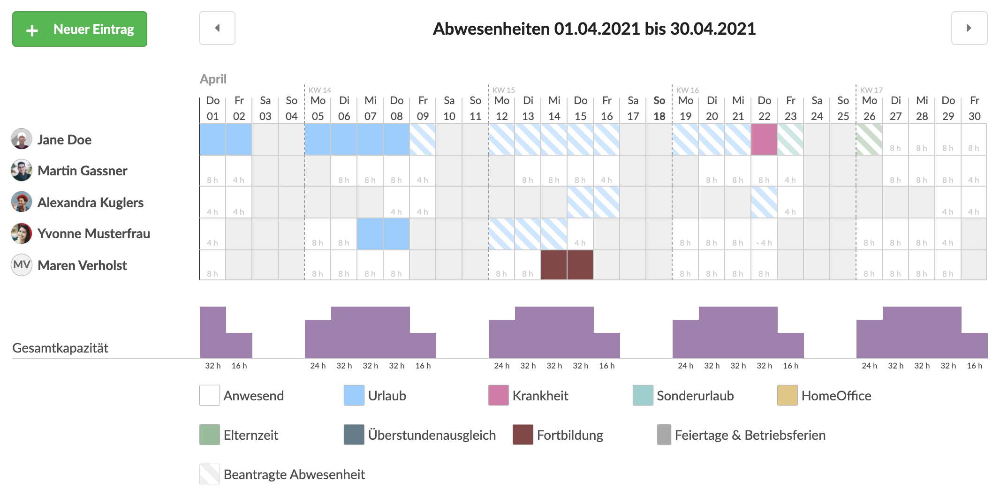
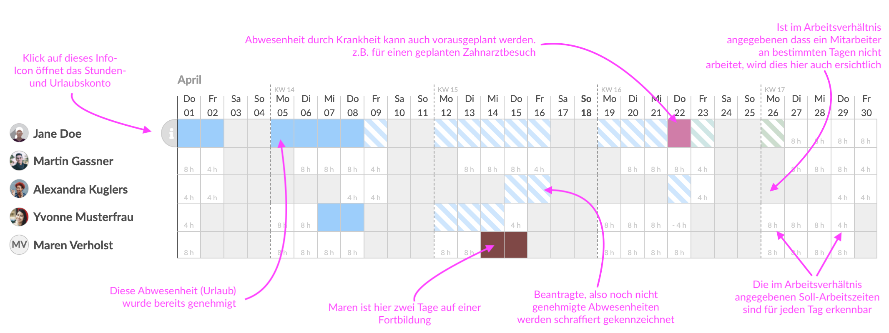
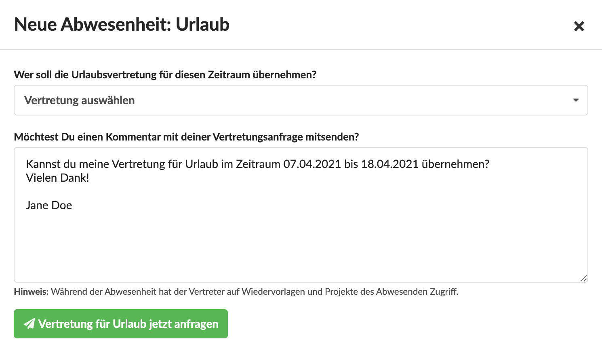
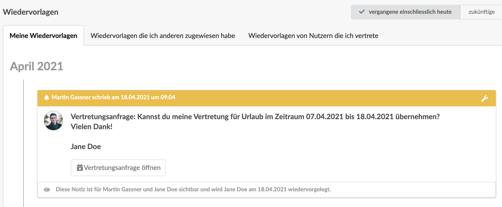
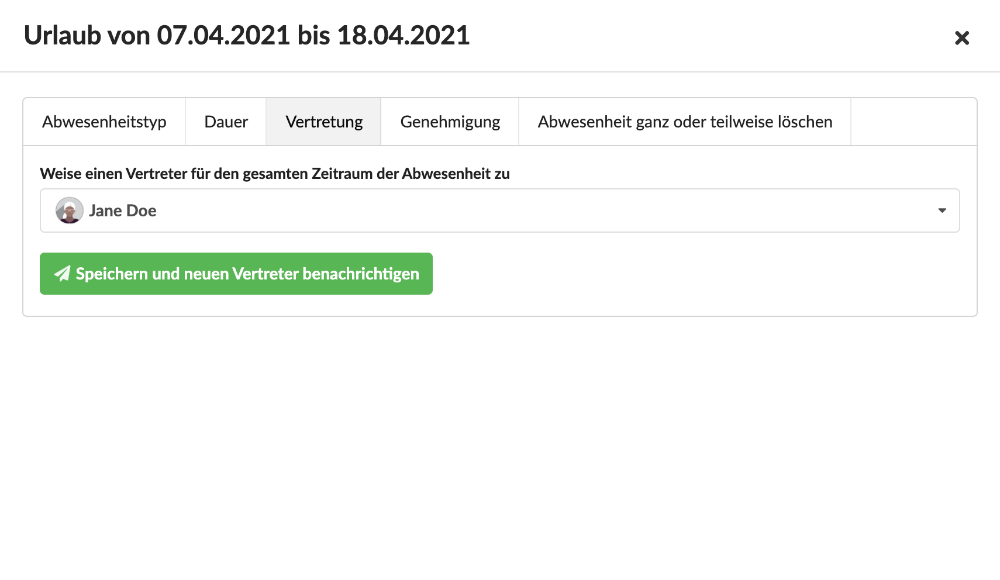
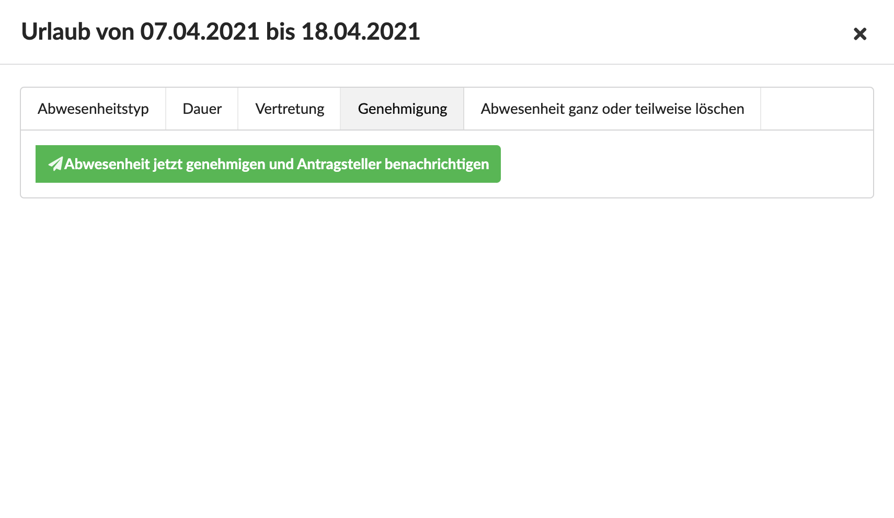
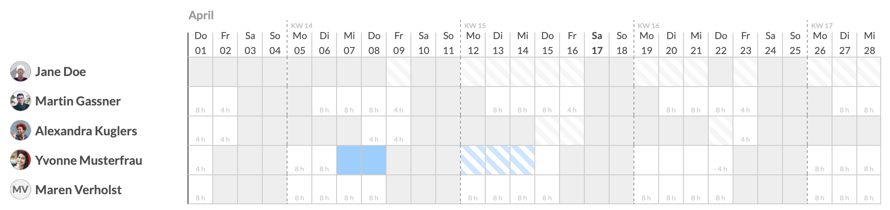

# Abwesenheitskalender

## Die Kalenderansicht

Die Kalenderansicht besteht aus einem Button \(links oben\), mit dem ein Neuer Abwesenheitsantrag erstellt werden kann.

Oberhalb des Kalenders finden wir eine Blätterfunktion, mit der wir auf der Zeitleiste weiter vor oder zurück blättern können um einen anderen Zeitraum zu betrachten. Die länge des Zeitraums hängt von der Grösse deines Browserfensters ab.

Unterhalb des Kalenders gibt es eine Übersicht über die Gesamtkapazität des Teams in Stunden. Diese Grafik ist nur sichtbar, wenn der Nutzer die entsprechende Berechtigung dazu hat.

Ganz unten finden wir eine Legende, die die verschiedenen möglichen Abwesenheitstypen anzeigt.

### Darstellung verschiedener Anwendungsfälle im Kalender

In diesem Beispiel lässt sich gut erkennen, dass die genehmigten und beantragten Abwesenheiten in Kalenderwoche 15 sich überschneiden und zum Teil nur eine Person anwesend wäre.

## Neue Abwesenheit beantragen

Über den grünen Button links oben können Nutzer - sofern Sie die Berechtigung dazu haben Einträge im Kalender für sich - und sofern sie auch dazu berechtigt sind - auch für andere, vornehmen.

Ob ein Eintrag sofort als genehmigt im Kalender auftaucht, hängt davon ab was für ein Abwesenheitstyp ausgewählt wurde und ob dieser Type vertretungs- und /oder genehmigungspflichtig ist.

Mehr zur Konfiguration von Abwesenheitstypen findet sich hier:



### Vertretungspflichtige Abwesenheiten

Ist Abwesenheitstyp Vertretungspflichtig, muss der beantragende Nutzer bereits beim Stellen des Antrags eine Vertretung auswählen. 

Die Vertretung erhält dann eine Benachrichtigung und finde in ihren Wiedervorlagen eine neue Wiedervorlage ... 

... mit der Bitte die Vertretung entweder zu übernehmen oder abzulehnen.

### Genehmigungspflichtige Abwesenheiten

Ist die Vertretung genehmigungspflichtig, wird sie nach der Beantragung über eine Wiedervorlage den Personen zugewiesen, die im Abwesenheitstyp als Genehmiger eingetragen sind.

Die Zuweisung erfolgt bei einem vertretungspflichtigen Abwesenheitstyp erst, nachdem die Vertretung zugesagt hat.

#### Genehmigung durch zwei Personen

Ist im Abwesenheitstyp definiert, dass eine Genehmigung durch eine _zweite_ Person erfolgen muss, erhalten die für die zweite Genehmigung hinterlegten Genehmiger eine Wiedervorlage mit der Bitte um Genehmigung erst, nachdem die erste Genehmigung erteilt wurde.

## Abweichungen vom Prozess

### Vertretung zuweisen \(anstatt anzufragen\)

Im Kalender kann eine Abwesenheit zu jedem Zeitpunkt auch durch eine entsprechend berechtigte Person durch einen Klick geöffnet werden. Im Dialog kann im Reiter "Vertretung" dann einfach eine Person ausgewählt werden. Die Vertretung wird dieser Person dann einfach zugewiesen, sie hat keine Möglichkeit die Vertretung abzulehnen, wird jedoch über die Zuweisung mit einer Benachrichtigung informiert.

### Abwesenheiten \(auch ohne Vertretung, erste oder zweite Genehmigung\) genehmigen

Im Kalender kann eine Abwesenheit zu jedem Zeitpunkt auch durch eine entsprechend berechtigte Person durch einen Klick geöffnet werden. Im Reiter "Genehmigung" des Dialogs kann hier einfach eine Genehmigung erteilt werden - unabhängig davon ob eine Vertretung, oder erste und zweite Genehmigung benötigt wird.

## Datenschutz & Abwesenheitstypen

Bei Mitarbeitern ohne die Berechtigung _Abwesenheiten &gt; Kalender &gt; Abwesenheitstypen andere Nutzer erkennen_ geht der Abwesenheitsgrund andere Mitarbeiter nicht aus dem Kalender hervor. Es ist lediglich zu erkennen, ob ein Nutzer Abwesend oder anwesend ist. Geplante \(also noch nicht genehmigte\) Abwesenheiten, sind auch hier gestreift - jedoch ohne Abwesenheitstyp - ersichtlich.

Für Yvonne ist in diesem Beispiel nur an ihren eigenen Abwesenheiten der Typ anhand der Farbe zu erkennen:

## Abwesenheiten ändern oder löschen

Durch Klick auf eine Abwesenheit im Kalender öffnet sich ein Dialog, der mir erlaubt, den Abwesenheitstyp zu ändern.

Ich kann im Reiter "Abwesenheit ganz oder teilweise löschen" auch entweder den angeklickten Tag oder den ganzen Abwesenheitsantrag löschen.

Ggf. noch existierende Wiedervorlagen für Vertretungen oder Genehmigungen werden dann enbenso gelöscht.

## Kalender als iCal abonnieren

Du kannst den Abwesenheitskalender auch mit deinem Apple iCal, Google-Calendar oder Outlook Kalender abonnieren.

Wie das geht steht hier:



