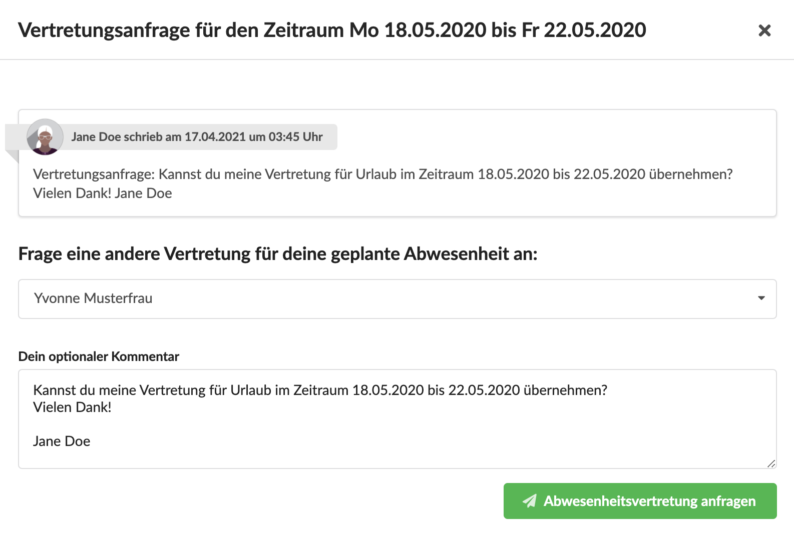
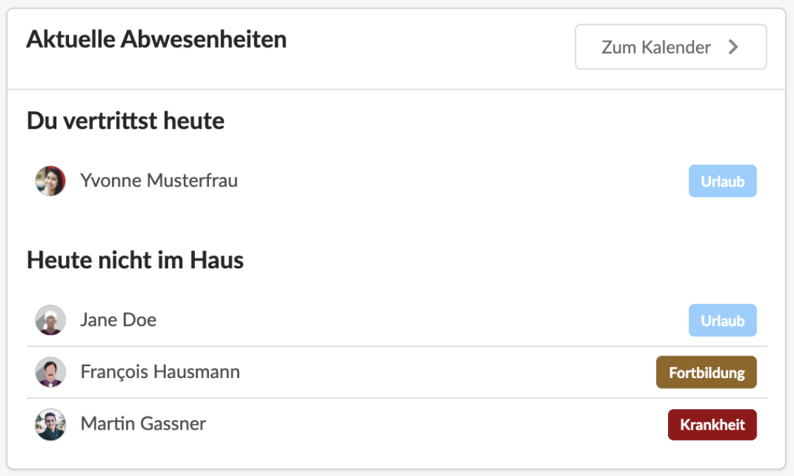

# Abwesenheitsvertretungen

## Vertretung für eigene Abwesenheit anfragen

In diesem Video wird gezeigt, wie eine Abwesenheit angefragt wird und wie - sofern konfiguriert - eine Vertretung für den Abwesenheitszeitraum gesucht wird:



## Vertretung für einen Kollegen übernehmen

Hier sehen wir, wie ein Nutzer die Abwesenheitsvertretung für einen anderen Kollegen übernehmen oder ablehnen kann:



## Übersicht Zeiterfassung &gt; Vertretungen

In dieser Übersicht finde ich alle Vertretungsanfragen, die andere Nutzer an mich gestellt haben und kann diese beantworten.

## Vertretungsanfragen an mich

Vertretungsanfragen an mich befinden sich  - sofern gegeben - in der linken Spalte. Durch Klick auf "Beantworten" öffnet sich ein Dialog der mir erlaubt, eine Vertretung zu übernehmen oder abzulehnen.

## Vertretungsanfragen von mir

In der rechten Spalte finde ich - sofern gegeben - Vertretungsanfragen, die ich an andere Nutzer des Teams gestellt habe.

Ich kann mich hier solange die Vertretung noch nicht zugesagt hat auch entscheiden, einen anderen Vertreter anzufragen.  
Die Wiedervorlagen an den ursprünglich ausgewählten Vertreter werden dadurch gelöscht.

## Vertretungen und Wiedervorlagen

Vertretungen und Abwesenheiten werden auch auf dem Dashboard angezeigt:

In diesem Screencast wird gezeigt, was passiert wenn Du eine Vertretung übernimmst und wie du auf die Wiedervorlagen der Kollegin, die du vertrittst zugreifen kannst.



## Vertretungssprozess abbrechen

Möchte ich den Prozess abbrechen, kann ich meine Abwesenheitsanfrage im Kalender einfach löschen.

