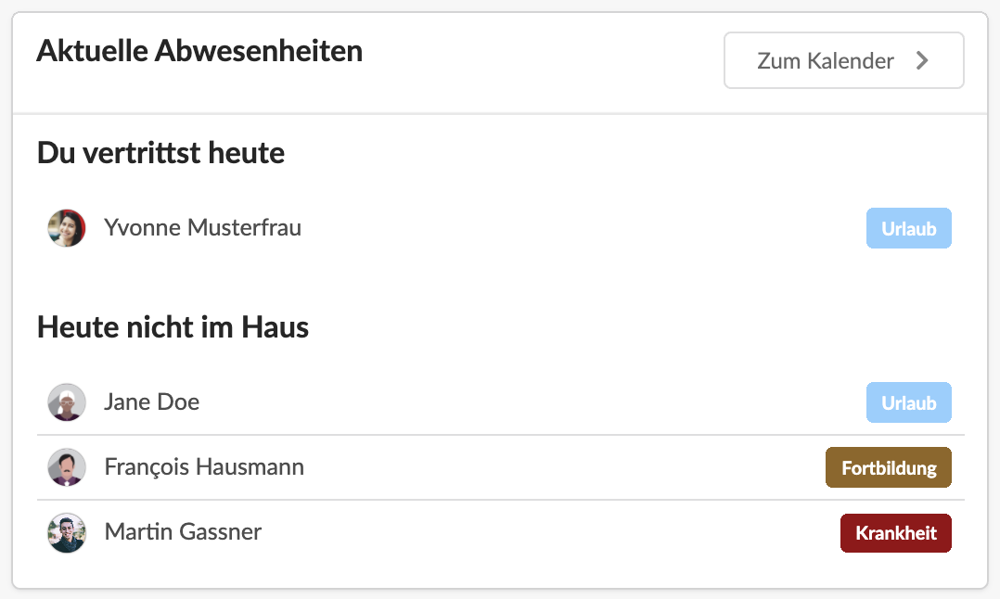
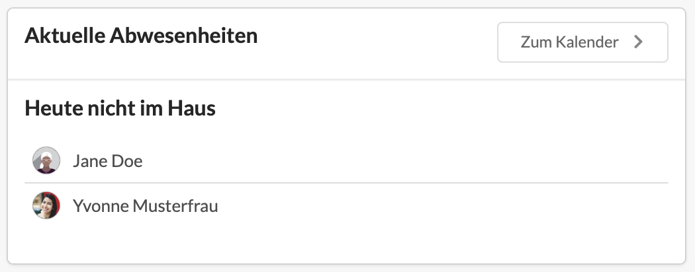

# Dashboard-Widget "Aktuelle Abwesenheiten"

Die Dashboard-Kach "Aktuelle Abwesenheiten" zeigt einer Nutzerin zum einen wen sie heute vertritt, zum Anderen, wer sonst noch nicht im Haus ist.

Bei Mitarbeitern ohne die Berechtigung _Abwesenheiten &gt; Kalender &gt; Abwesenheitstypen andere Nutzer erkennen_ geht der Abwesenheitsgrund nicht aus der Liste hervor:


**Tipp**  
Aus Datenschutzgründen sollten nur Nutzer, die Abwesenheiten genehmigen, Zugriff auf den Abwesenheitstyp, also den Grund der Abwesenheit haben.


