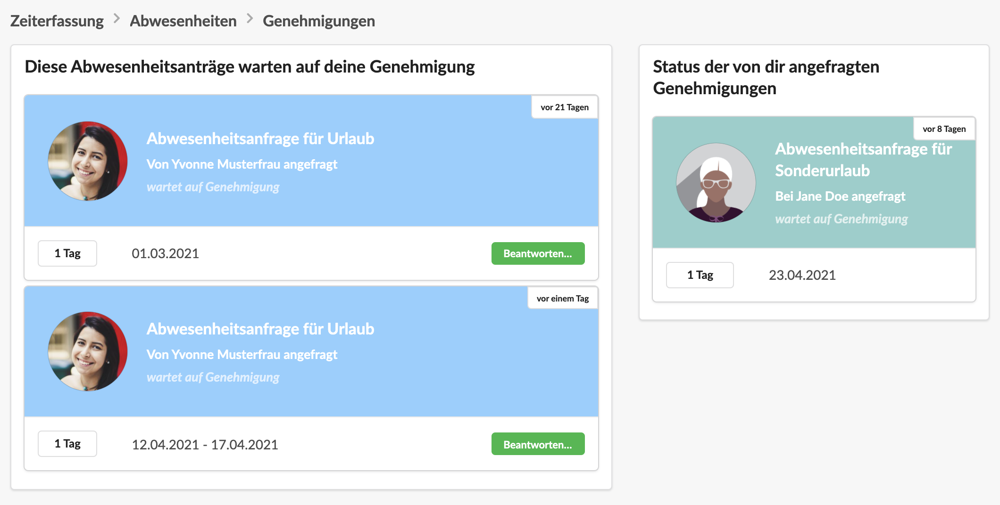
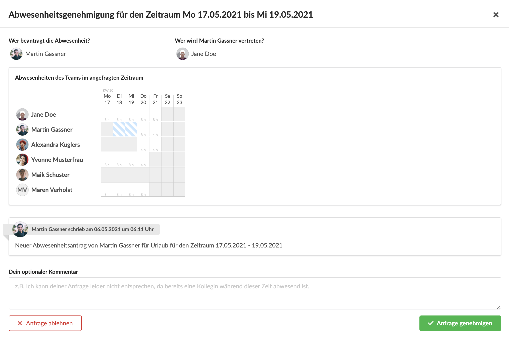

# Genehmigungen von Abwesenheiten



In diesem Screencast erfährst du, wie deine Abwesenheiten genehmigt werden, wie du den Status deiner Abwesenheiten überprüfen kannst und wie du - sofern du die Berechtigung dazu hast - die Abwesenheitsanträge deiner Kollegen genehmigen oder ablehnen kannst.

## Genehmigungsanfragen

Unter Zeiterfassung &gt; Genehmigungen finden wir auf Genehmigung wartende Abwesenheiten:

## Genehmigungsanfragen an mich

In der linken Spalte finde ich Abwesenheitsanfragen meiner Kollegen an mich. Durch Klick auf "Beantworten" kann ich diese öffnen und genehmigen. Es ist dabei für mich ggf. auch ersichtlich, wer den Abwesenden vertritt sofern der Abwesenheitstyp eine Vertretung erfordert.

## Genehmigungsanfragen von mir

Die rechte Spalte zeigt, welche meiner Anfragen auf Genehmigung warten. Die Liste ist lediglich informativ, ich habe hier keinen Einfluss etwas am Status meines Antrags zu ändern, solange ich nicht selbst meinen Antrag genehmigen darf.

## Genehmigungsprozess abbrechen

Möchte ich den Prozess abbrechen, kann ich meine Abwesenheitsanfrage im Kalender einfach löschen.

