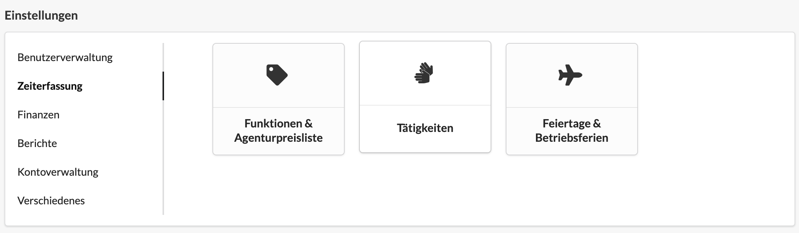
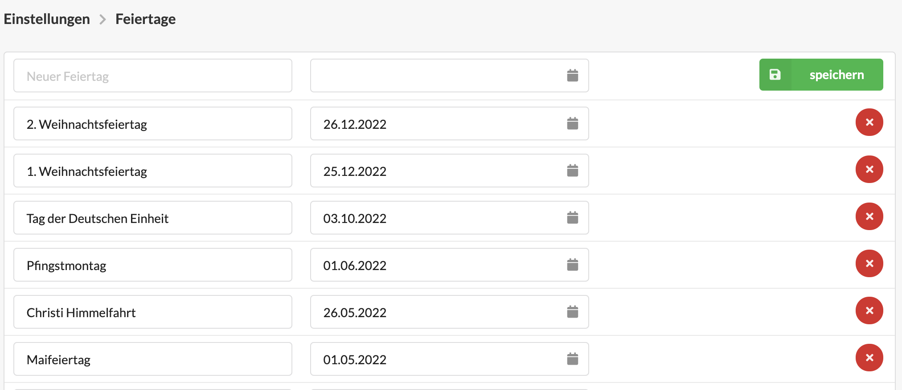

# Feiertage und Betriebsferien

## Feiertage und Betriebsferien in der Agenturverwaltung

Feiertage und Betriebsferien sind Tage, an denen die regulär vereinbarte Arbeitszeit eines festangestellten Mitarbeiters auf null \(=0\) gesetzt wird.

Mit der Konfiguration von Feiertage und Betriebsferien werden daher Abweichungen zur der regulär vereinbarte Arbeitszeit je Wochentag eines Mitarbeiter vorgenommen.

Dies gilt nur für festangestellten Mitarbeiter mit einem hinterlegten Stundenkonto. Feiertage und Betriebsferien haben keine Auswirkungen auf freiberufliche Mitarbeiter. 

## Konfiguration von Feiertagen und Betriebsferien

Die Liste der konfigurierten Feiertage und Betriebsferien kann durch berechtigte Benutzer in den Einstellungen unter Zeiterfassung &gt; Feiertage und Betriebsferien bearbeitet werden.  
 

Auf der Konfigurationsseite werden alle konfigurierten Feiertage und Betriebsferien aufgelistet.   
 

Über einen Klick auf den x-Button \(  \) können Feiertage und Betriebsferien entfernt werden. 

In der ersten Zeile kann ein neuer Feiertag hinzugefügt werden, indem zuerst eine Bezeichnung vergeben und das entsprechende Datum ausgewählt wird. Mit einem anschließenden Klick auf den Speichern-Button wird der Feiertag hinzugefügt.    
 

