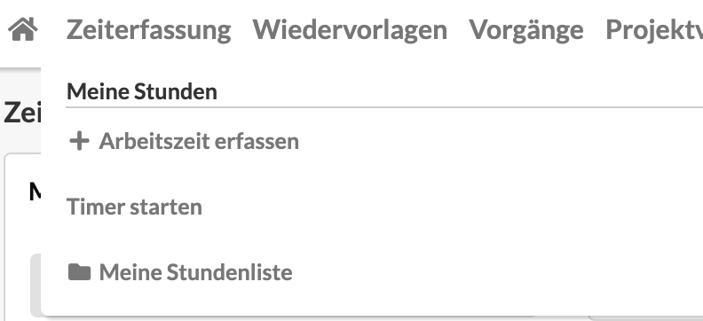
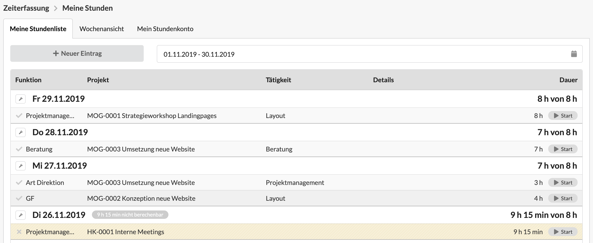
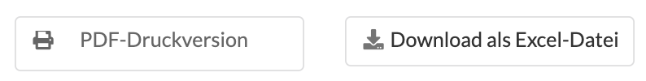

# Meine Stundenliste

 

Ihr gelangt sofort zur Übersicht aller  Zeiterfassungseinträge, gruppiert nach Kalendertag und erhaltet Basisinformationen wie Projekt, Tätigkeit und erfasste Dauer zu jedem Eintrag.

Die Liste zeigt Einträge eines bestimmten Zeitraums - z.B. die aktuelle Woche. Dieser Zeitraum kann über den Zeitraumfilter oben ausgewählt werden  
 

Zur Erstellung eines neuen Eintrags könnt ihr die Schaltfläche "Neuer Eintrag" verwenden oder auf das Datum eines Tages klicken. 

In der rechten Spalte "Dauer" sehen wir   
a\) welcher Dauer zu den einzelnen Einträgen gespeichert wurde  
b\) wieviel Zeit die Dauer aller Einträge eines Tages in Anspruch genommen hat

Ist ein Mitarbeiter festangestellt, ist an der Tagesdauer auch zu erkennen wieviel Arbeitszeit an diesem Tag vereinbart war, z.B. 8 Stunden.

Unterhalb der Zeiterfassungsliste könnt ihr die Einträge des Zeitraums den ihr gerade ausgewählt habt auch als PDF-Druckversion oder als Excel-Spread-Sheet exportieren:

Zum Bearbeiten eines Eintrags könnt ihr diesen einfach anklicken und die Änderungen anschließend in Detail-Dialog vornehmen.

Über die Schaltfläche "Start" ganz rechts in jedem Zeiterfassungseintrag könnt ihr den Timer zu diesem Eintrag erneut starten. Mehr zum Timer erfahrt ihr hier: [Timer](timer.md).

