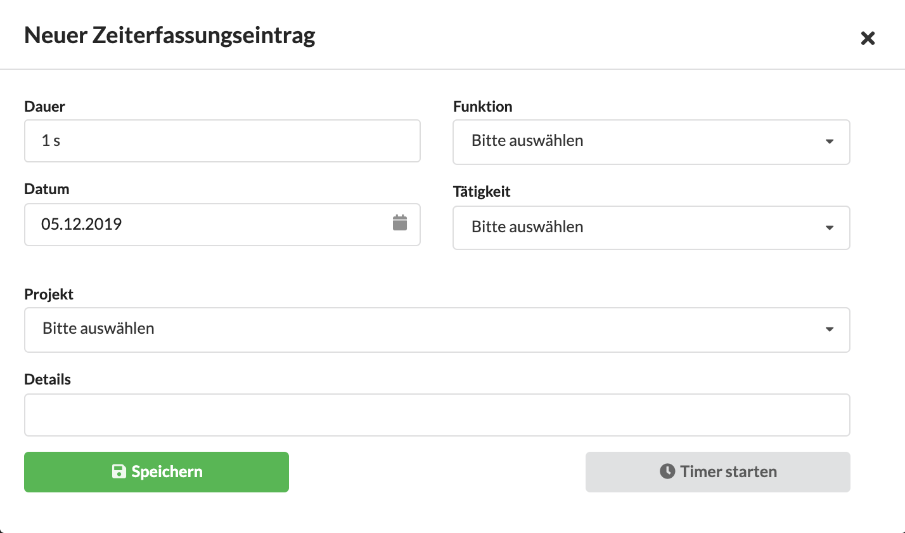

# Meine Stundenliste

In diesem Video erfahren wir etwas über die Möglichkeiten der Zeiterfassungsliste, wie wir einen Zeiterfassungseintrag anlegen und wie wir Einträge bearbeiten können. Solltet ihr diesen Inhalt lieber lesen wollt, scrollt einfach über das Video hinweg.



\
Über das Menü  Zeiterfassung > Meine Stundenliste gelangen wir zu unserer Stundenliste.&#x20;

Ihr gelangt sofort zur Übersicht aller  Zeiterfassungseinträge, gruppiert nach Kalendertag und erhaltet Basisinformationen wie Projekt, Tätigkeit und erfasste Dauer zu jedem Eintrag.

Die Liste zeigt Einträge eines bestimmten Zeitraums - z.B. die aktuelle Woche. Dieser Zeitraum kann über den Zeitraumfilter oben ausgewählt werden\
&#x20;

Zur Erstellung eines neuen Eintrags könnt ihr die Schaltfläche "Neuer Eintrag" verwenden oder auf das Datum eines Tages klicken.&#x20;

Es öffnet sich dann ein Dialog in dem wir Tag, Dauer, Funktion in der wir gearbeitet haben und Projekt angeben können.

> **Folgende Eingabeformate für die Dauer eines Eintrags werden erkannt**\
> `15 .  => 15 min`\
> `0.25  => 15 min`\
> `1,    => 1 h`\
> `1:00  => 1h`\
> `100   => 1h`\
> `1,5   => 1 h 30 min`\
> `130   => 1 h 30 min`\
> `1 30  => 1 h 30 min`\
> `02:45 => 2 h 45 min`\
> `245   => 2 h 45 min`\
> `2,75  => 2 h 45 min`

In der rechten Spalte "Dauer" sehen wir \
a) welcher Dauer zu den einzelnen Einträgen gespeichert wurde\
b) wieviel Zeit die Dauer aller Einträge eines Tages in Anspruch genommen hat

Ist ein Mitarbeiter festangestellt, ist an der Tagesdauer auch zu erkennen wieviel Arbeitszeit an diesem Tag vereinbart war, z.B. 8 Stunden.

Zum Bearbeiten eines Eintrags könnt ihr diesen einfach anklicken und die Änderungen anschließend in Dialog vornehmen.

Über die Schaltfläche "Start" ganz rechts in jedem Zeiterfassungseintrag könnt ihr den Timer zu diesem Eintrag erneut starten. Mehr zum Timer erfahrt ihr hier: [Timer](timer.md).

### Export der Stundenliste

Unterhalb der Zeiterfassungsliste könnt ihr die Einträge des Zeitraums den ihr gerade ausgewählt habt auch als PDF-Druckversion oder als Excel-Spread-Sheet exportieren:

## Mehrere Einträge gleichzeitig bearbeiten

Über den Button "Stapelbearbeitung" rechts oben öffnet sich ein Dialog mit einer Liste der auf dieser Seite sichtbaren Einträge.

Die mit dem Häkchen links markierten Einträge, können alle in einem Schritt geändert werden. Dabei kann je nach Kontext z.B. das Projekt geändert werden, die Funktion oder Tätigkeit, oder - in Stundenlisten eines Projekts zum Beispiel - der Mitarbeiter.

