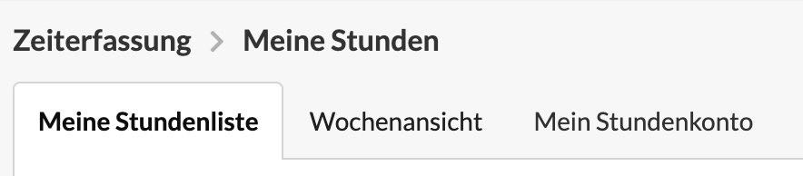
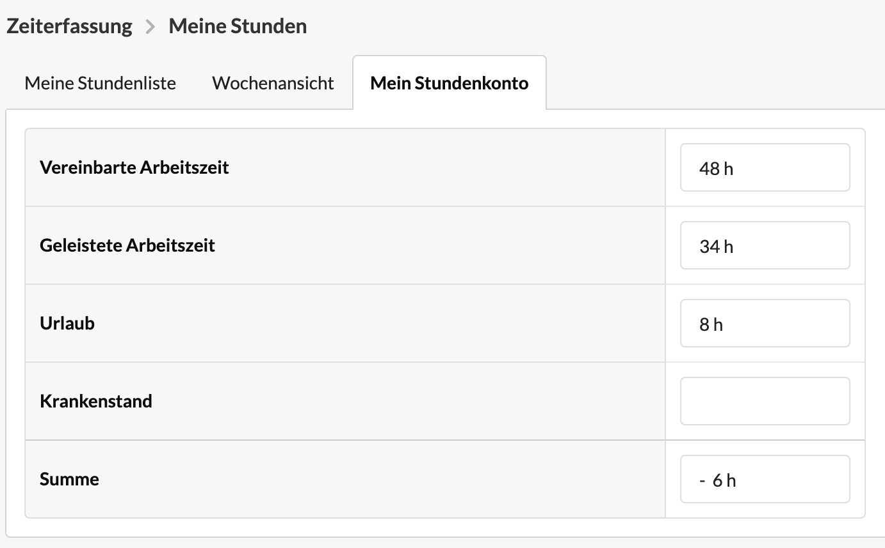

# Stundenkonto

Das Stundenkonto ist euer Mini-Dashboard mit den wichtigsten Informationen rund um die Zeiterfassung. Auf einen Blick könnt ihr erkennen, ob euer Arbeitszeitkonto ausgeglichen ist.

Zum Stundenkonto gelangt ihr über Zeiterfassung > Meine Stundenliste

Anschließend wählst du hier den Reiter "Mein Stundenkonto" aus.\
&#x20;__&#x20;

Im Stundenkonto werden euch nun folgende Daten angezeigt:&#x20;

* **Vereinbarte Arbeitszeit:** Diese berechnet sich aus der mit deinem Unternehmen vereinbarten Arbeitszeit, die für dein Nutzerkonto durch einen Administrator hinterlegt wurden, abzüglich Feiertage und Betriebsferien. Die Zählung beginnt am Tag deiner ersten Zeitbuchung im System zu deinem aktullen Arbeitsvertrag und endet am heutigen Tag.
* **Geleistete Arbeitszeit:** Dies ist die Summe der erfassten Zeiterfassungseinträge mit Ausnahme von Einträgen für Urlaub und Krankheit.
* **Urlaub:** Dies ist die Summe der erfassten Urlaubstage.
* **Krankenstand:** Dies ist die Summe der erfassten Krankheitstage
* **Summe:** Die Summe berechnet sich aus Vereinbarter Arbeitszeit abzüglich \
  Geleisteter Arbeitszeit, Urlaub und Krankenstand.

